****### Q1.

**Answer:**
	Yes, both Google Chrome and Firefox offer built-in password management features. However, they are encrypted using the OS's encryption mechanism and stored locally on your device. 
	
- **Google Chrome** doesn't offer a master password feature. Once we login to OS account, accessing saved passwords in Chrome doesn't require additional authentication.
- **Firefox** provides and optional `Primary Password` option. When it is enabled, it requries the user to enter this password to access the stored credentials, adding an extra layer of security. 

| Feature                                 | Google Chrome                                                                 | Firefox                                                                                                  |
| --------------------------------------- | ----------------------------------------------------------------------------- | -------------------------------------------------------------------------------------------------------- |
| Master Password                         | Not Available                                                                 | Yes (Optional)                                                                                           |
| Preventing Unauthorized Access          | anyone with access to your user account can view passwords                    | Master password ensures that only individuals who know this password can access the credentials          |
| Cloud Sync                              | Enabled to sync across devices - signed in                                    | Can Sync password across devices - signed in                                                             |
| Server Knowledge of Plaintext passwords | They are encrypted. Google claims it cannot access your plaintext credentials | Encrypts passwords before syncing them to mozilla's servers, ensuring Mozilla can't have access to them. |

---
---

### **Q2**

**a)**
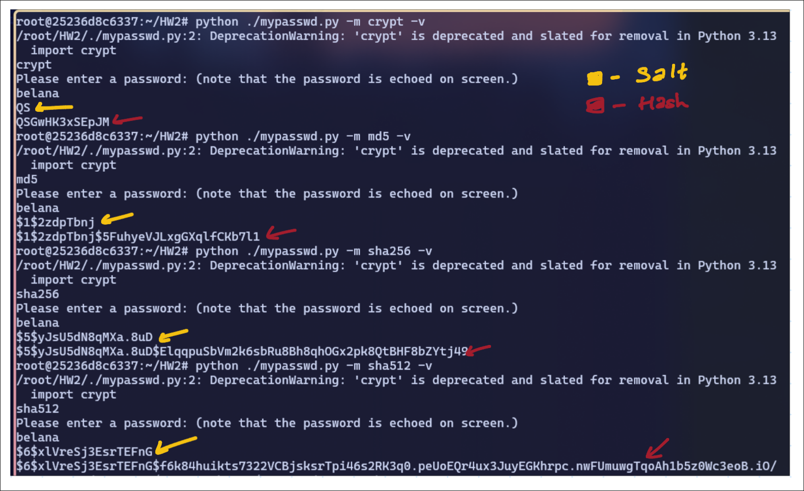
**my observations:**
1. When running `md5`, `crypt`, `sha256`, `sha512`, we get a different Hash every time since the salt is randomly specified. 
2. When in verbose mode `-v`, I see the salt keeps changing every time I run any of the methods. No matter the change in method, this program generates a random Salt. 
3. If given a same salt using `-s`, the program generates the same hash value. 

---

**b)**

`aA`:
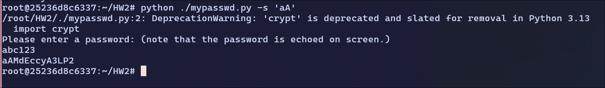
hash: `aAMdEccyA3LP2`

`$1$lXyXHBaP`:
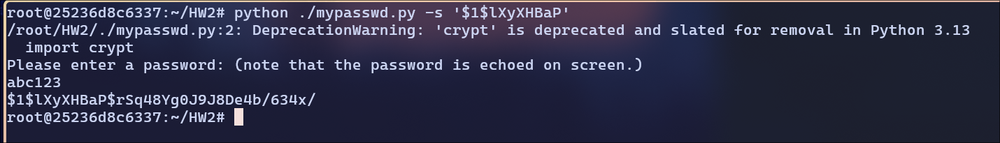
hash: `$1$lXyXHBaP$rSq48Yg0J9J8De4b/634x/`

`$5$sHsbaOklL9HZRKZA`:
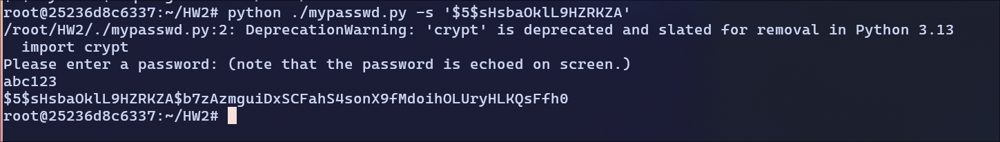hash: `$5$sHsbaOklL9HZRKZA$b7zAzmguiDxSCFahS4sonX9fMdoihOLUryHLKQsFfh0`

---

**c)**

`CUnRTj3ykJUkc`:
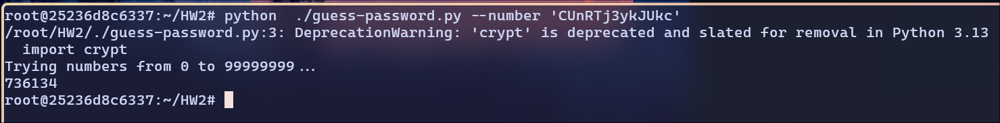
Password is `736134`

`$1$2ewNLDoz$GxiXqiOZweZPTzh4spxzs0`:
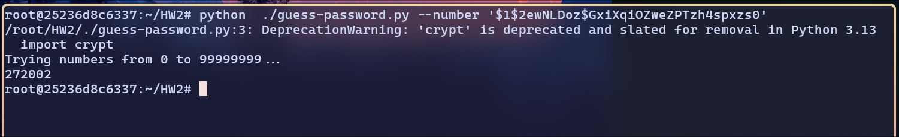
Password is `272002`

`$5$waAsZWO52fJSzE.x$.nl4eoocyyWHXoeNT.cIsb1ycO/comIfwT/GoIcav27`:
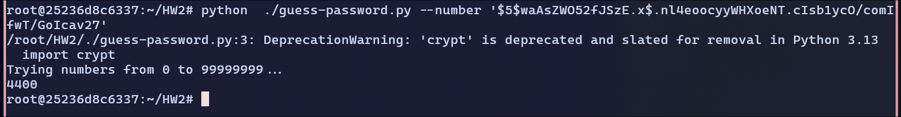
Password: `4400`

---

**d)**

`SehYy7JsbWXCk`:
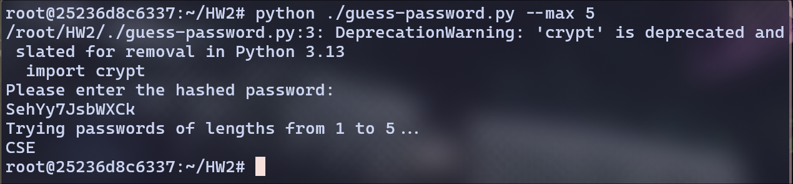
Password: CSE

`$1$BSmEpAee$xnm0kEcmST7CdeeIa97p3/`:
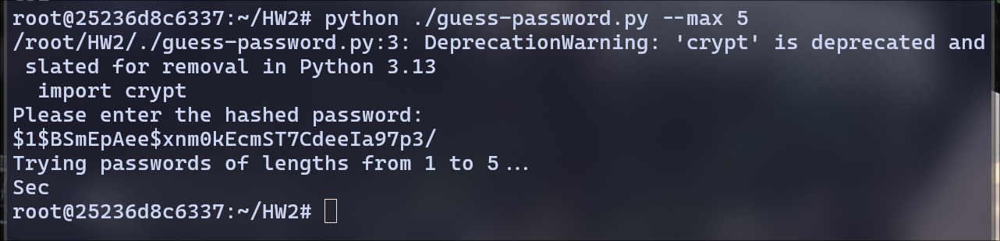
Password: Sec

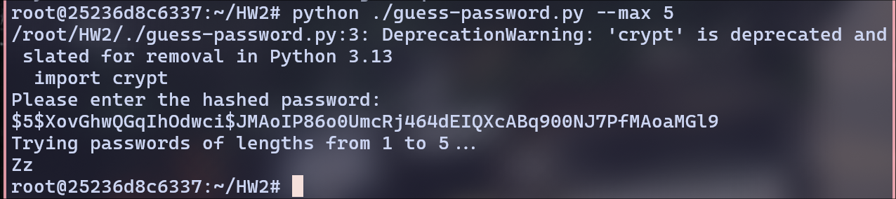
Password: Zz

---
**e)**


I used a number `91080` to create Hashes

| Method | Hash                                                                                                         |
| ------ | ------------------------------------------------------------------------------------------------------------ |
| crypt  | uqT5B1gakEpDY                                                                                                |
| md5    | `$1$RNCymQDW$Z.GYbORbQCrSuDRrCLPH80`                                                                         |
| SHA256 | `$5$yuUPJgolmF.C/fC9$zqVJnysrosCGqjtdA/X4/z7N3tuuo.MacbwL2z0aRi6`                                            |


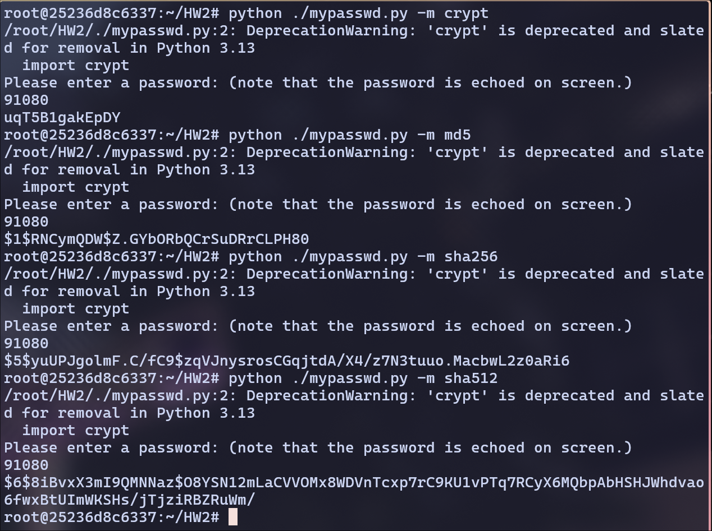


Running the `guess-passwd.py` to get the original message using the following command.

```bash
time python ./guess-passwd.py '<hash_here>'  --number --max 5
```

Total Execution Time: Adding `user` + `sys` to get Total time it took to guess the message. 

Guesses Per Second: max/total time = 100000/total time.

| Method | Execution Time | Guesses Per Second | Ratio with SHA256 |
| ------ | -------------- | ------------------ | ----------------- |
| SHA256 | 224.698s       | 445                | 1                 |
| Crypt  | 0.520s         | 192,307            | 432.150           |
| MD5    | 11.246s        | 8892               | 19.982            |

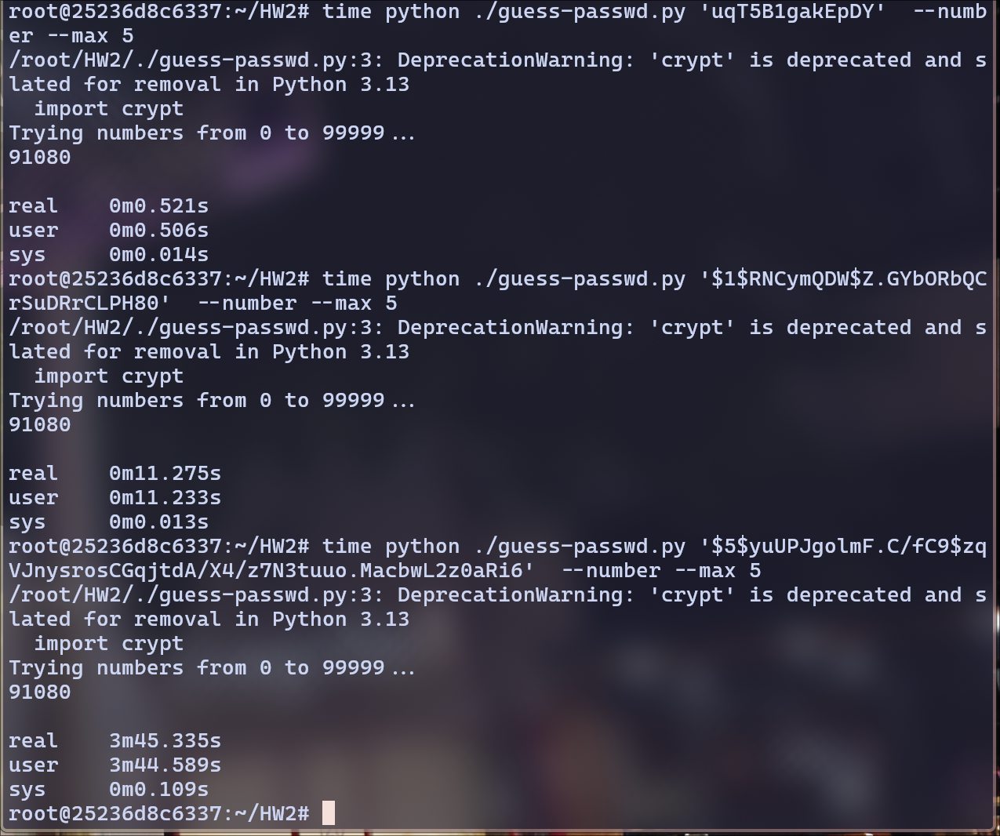

---

**f)**

1. **Ten decimal digits**
	Time = Total possible passwords / passwords per second
		 = $10^{10}$ / 100000 = 100,000 seconds
		 = 1 day (approximately)
   
   
   
2. **Ten characters of decimal digits, uppercase and lowercase English letters.**
	
	Choices = 26 + 26 + 10 = 62
	Total passwords = $2^{62}$

   Time = Total Passwords / 100,000 = 266 years (approx.)
   
   
3. **Four English words randomly chosen from a dictionary of 10,000 words. A word maybe chosen multiple times. For example, “ILoveComputerScience”, “UpPalaceRubSoap”, or “SesameSesameOpenDoor”.**
   
   
	Each word is randomly chosen from 10,000 words and we have four words in it
	
	So, Total Paswords = $10,000^4$ = $10^{16}$

	Total Time = Total Passwords / 100,000
			  = 3169 years (approx.) 

---
---
