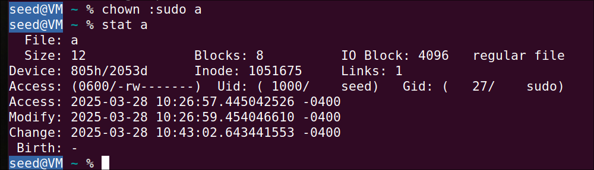
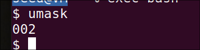

Q1:

a) Find out the permissions on `/etc/passwd` and explain the meaning of the permissions.

**A:**


I can see that `/etc/passwd` file has permissions 0644 meaning that `root`  has read and write permissions, group `root` has read and others has read permissions only.


---

b) Find out the permissions on command mount and explain the meaning of the permissions. You can find the path to the program with which command “which mount

A:


The permissions set are `-rwsr-xr-x`:

1. `-` : regular file
2. `rws` - Permissions for the owner (read, write and **setuid**)
	1. `s` indicates **setuid** (it allows users to run the file with the permissions of the owner) (here, it's root)
3. `r-w`: Permissions for the group (Read and execute)
4. `r-x`: Permissions for others(read and execute)


Currently, the permissions are `root` user and `root` group with 1 hard link.

**Purpose of setuid**: Allow regular users to run `mount` with root privileges in a safe way.

---

c. What is the primary group of user seed? What are the supplementary groups?

A:


Primary group for user `seed` is  `seed`.

Supplementary groups: `adm`, `cdrom`, `sudo`, `dip`, `plugdev`, `lpadmin`, `lxd`, `sambashare`, `docker`.


---

d. Create a new file a. Use a text editor or simply redirect output as “echo message > a”. Find its permissions and associated user id and group id.

A:


User id: 1000 - seed
Group id: 1000 - seed
Permissions: `0644` (user and group has r/w and other have only read permissions)


---
e. The command chmod can change permissions on files and directories. Use the command to change the permissions of file a so that group and other users do not any permissions.

A:


I set permissions as `600` so only user `seed` has permissions to read/write and other users and groups doesn't have access to it.

---

f. The command chown can change the owner and group associated with a file. Change the group associated with file a to sudo.



Command: `chown :sudo a`

---

g. Change file a’s group to ssh. If you do not run the command with sudo, you will see an error message. Why?


command: `sudo chown :ssh a`

- Since the file is grouped by sudo, any changes to the file needs super user privileges.
- also current user is not in group `ssh`

---
h. Now change file a’s group back to seed. Do you have to run the command with sudo? Why?

Command: `chown :seed a`

I don't need `sudo` to do that because, user `seed` already owned the file. A regular user can change the group ownership of a file without sudo if they own the file or member of the target group.

---
i. The default permissions on files can be controlled by umask in bash. Find out the umask value in your current bash session and explain its meaning.


it is `002`

The `umask` subtracts permissions from the default:

| File Type   | Default Permissions | umask | Final Permissions    |
| ----------- | ------------------- | ----- | -------------------- |
| Files       | `666`               | `002` | `664` -> `rw-rw-r--` |
| Directories | `777`               | `002` | `775` -> `rwxrwxr-x` |


---
j. How would you set the umask so the group and other users do not have any permissions on new files as in d)? Demonstrate that your method works


I set the umask by running:

```bash
umask 077
```

We can observe that when creating a new file, it doesn't set any permissions to group and others.


---
---
### **Q2.**

(50 points) In this exercise, we experiment with scripts, more specifically, bash scripts. First, create two files myls and ls in the directory, with your favorite text editor.

**myls** has the following three lines. The first line that starts with a hash tag is called shebang, which specifies the program that will interpret the script. The second line shows the username who runs the script and the third line invokes ls command.

```bash
#!/bin/bash
whoami
ls $*
```

ls has the following lines.

```bash
#!/bin/bash
echo "This is not the real ls."
```


a. Change the permissions of the two files so that everyone can run the scripts and only the owner and the group can write to the files. For example, seed should be able to run myls by typing./myls. Note that one needs to have the read permission to run a script.

A. 


---
b. bash searches executables in the directories listed in environment variable PATH. The directories are separated by colons. Find out the list of directories in PATH in your bash session.


1. /home/seed/.local/bin
2. /usr/local/sbin
3. /usr/local/bin
4. /usr/sbin
5. /usr/bin
6. /usr/games
7. /usr/local/games
8. /snap/bin


---
c. bash allows an environment variable set for specific commands. What happens if your run the following command? Explain the result.

```bash
PATH=. myls
```


- By setting `PATH=.` (dot = current directory), I told the shell to **search the current directory first** when running commands.
- So when `myls` calls `ls`, it's not calling `/bin/ls` — it's calling the fake `ls` script in the current directory.
- the fake `ls` script just echoes `"This is not the real ls."` — so that's what gets printed.
- `whoami` failed because `PATH` couldn't find whoami in current director `.`

---
d. How would you change myls so that the correct commands are executed even if someone sets PATH as in c)?

Run:
```bash
PATH=.:$PATH
```

Added current folder to the path.


---
e. Change the owner of myls to root and set the SUID bit on myls. Confirm the SUID bit is set correctly. Run the script as user seed. What’s the output of the script? Do you see anything unexpected? Try to list the files under directory “/root” and compare results from running the script directly and running it with sudo.


- I set all the permissions but the user didn't change to `root`.
- The files are printing from the actual `ls` itself.
- Unable to list the files in `root.`


If running with root, I can list the files in `/root`


