I have setup my Lab in a docker container using the ubuntu 20.04 image from docker hub. 

I have downloaded the `md5collgen` tool and set it up. Since I couldn't get a way to install the bless editor in the container, I have decided to use `xxd` to get the hex dump data from the binary file. 

## Lab Tasks

### 3.1 Generating Two Different Files with the Same MD5 Hash

**Question 1: If the length of your prefix file is not multiple of 64, what is going to happen?**

Answer: 

Prefix Size = 48 bytes

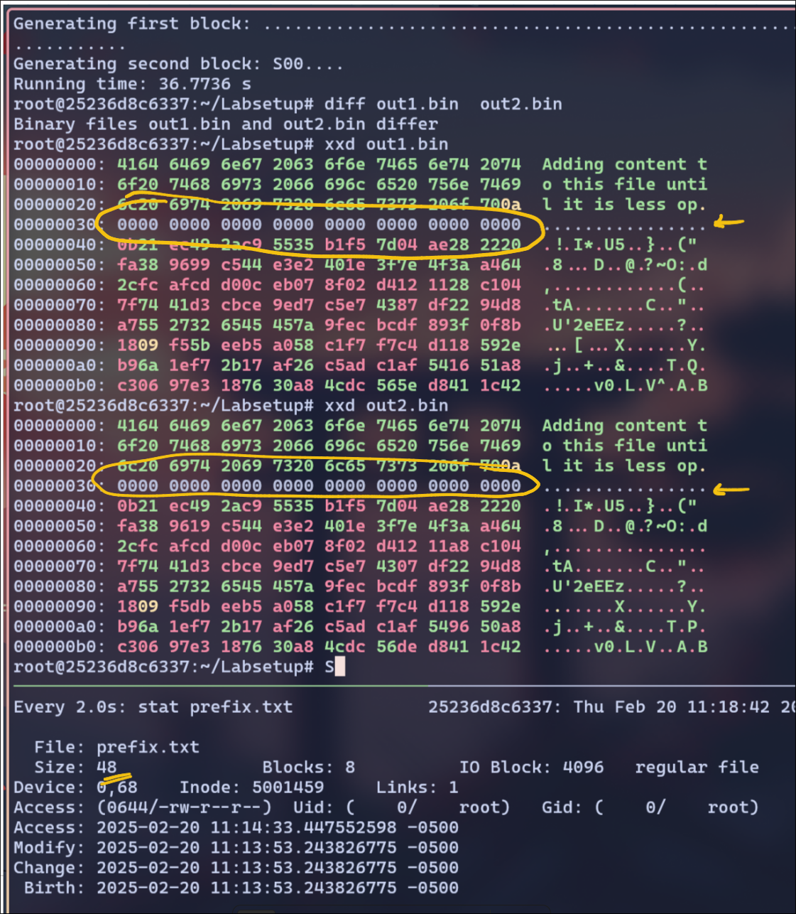

Here, my prefix is less than 64 bytes(not multiple), I see the out1.bin and out2.bin files are mismatching.  The `m5collgen` tool adds padding to the prefix to make it 64 bytes to ensure the input is properly formatted.
- 16 bytes of padding were added. The padding bytes are just Zeroes 
- The padding could add unintended differences in the output files, which might affect the collision.
- This is why the generated binary files were not perfectly identical in structure.
---
**Question 2. Create a prefix file with exactly 64 bytes, and run the collision tool again, and see what happens.**

Answer:
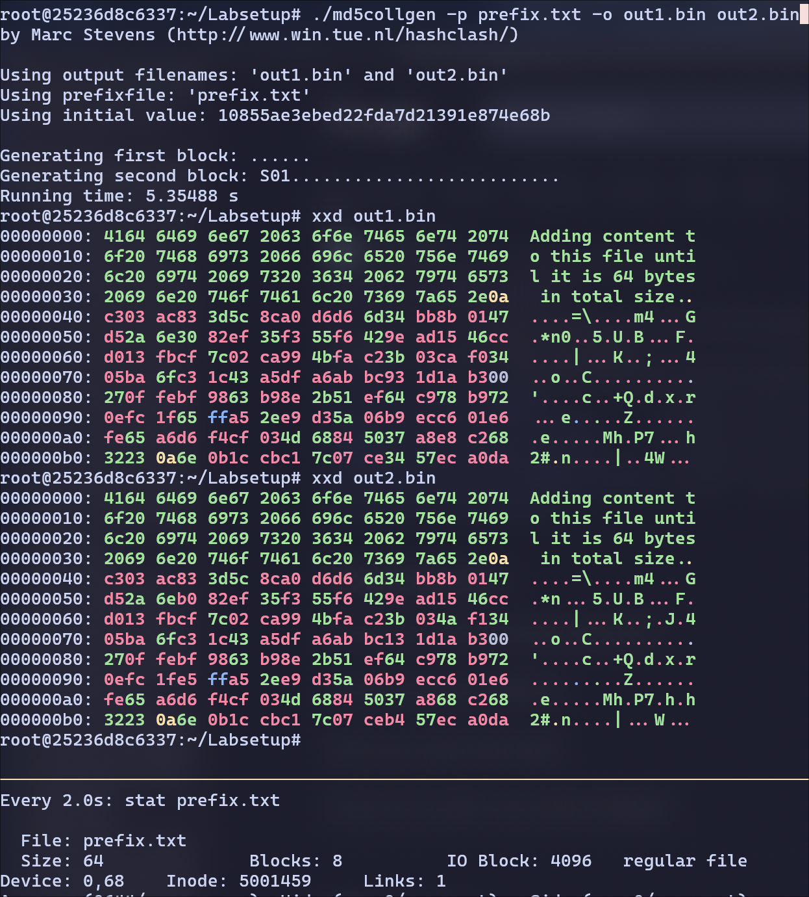
Since the prefix file is now 64 bytes, the tool didn't need to add any padding. All it did is, it added `P` to `out1.bin` and `Q` to `out2.bin`.

---
**Question 3. Are the data (128 bytes) generated by md5collgen completely different for the two output files? Please identify all the bytes that are different.**

Answer:

The 128 bytes generated by `md5collgen` are completely different for both the cases. Whether the prefix is padded to get 64 bytes or not, the P and Q are different but they do have some similarities.

here are the differences b/w out1.bin and out2.bin

With padding file:
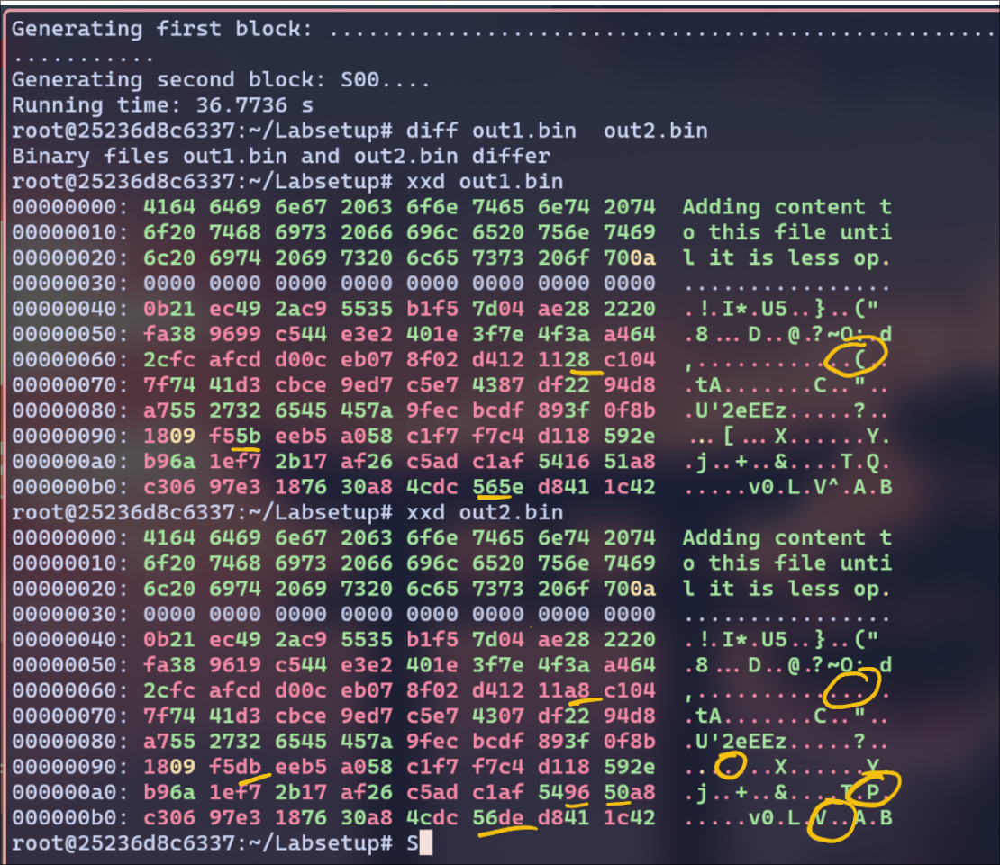

Without Padding:
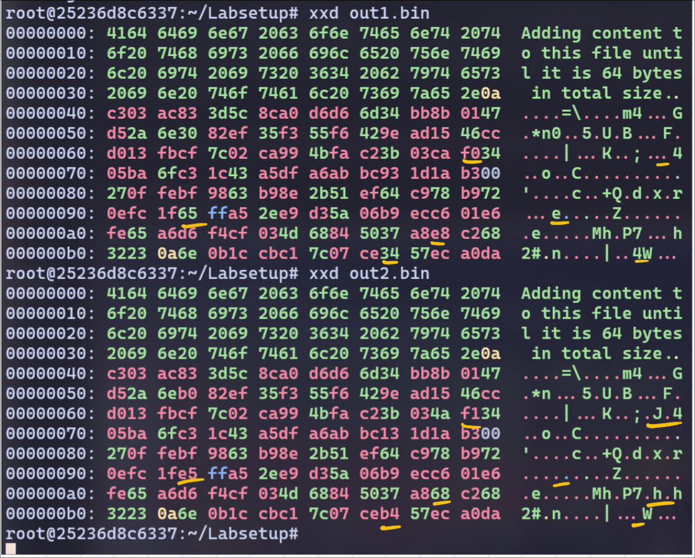

I can see a pattern here. The P and Q even though they are random strings, they are almost same. 
Only bytes 47, 84, 110, 124 differ from out1.bin and out2.bin.

---
---

### 3.2 Task 2: Understanding MD5’s Property

For out1.bin and out2.bin, I ran the `md5sum` command and the below is the output:
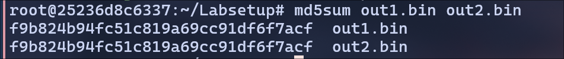

Created a new suffix file called `suffix.bin`:
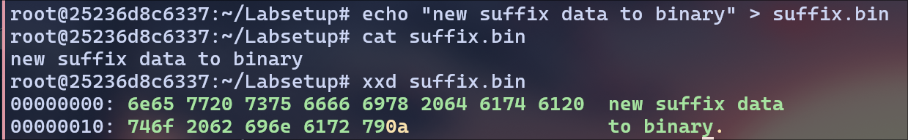

I have concatenated the out1.bin with suffix.bin file and the same for out2.bin file. 
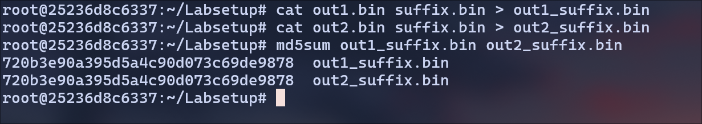


MD5(out1.bin) = MD5(out2.bin)
and MD5(out1.bin I suffix.bin) = MD5(out2.bin I suffix.bin)

where I represents concatenation.

---
---

### 3.3 Task 3: Generating Two Executable Files with the Same MD5 Hash

MyCode:
```c
#include <stdio.h>

unsigned char xyz[200] = {
	0x41, 0x41, 0x41, 0x41, 0x41, 0x41, 0x41, 0x41, 0x41, 0x41,
	0x41, 0x41, 0x41, 0x41, 0x41, 0x41, 0x41, 0x41, 0x41, 0x41,
	0x41, 0x41, 0x41, 0x41, 0x41, 0x41, 0x41, 0x41, 0x41, 0x41,
	0x41, 0x41, 0x41, 0x41, 0x41, 0x41, 0x41, 0x41, 0x41, 0x41,
	0x41, 0x41, 0x41, 0x41, 0x41, 0x41, 0x41, 0x41, 0x41, 0x41,
	0x41, 0x41, 0x41, 0x41, 0x41, 0x41, 0x41, 0x41, 0x41, 0x41,
	0x41, 0x41, 0x41, 0x41, 0x41, 0x41, 0x41, 0x41, 0x41, 0x41,
	0x41, 0x41, 0x41, 0x41, 0x41, 0x41, 0x41, 0x41, 0x41, 0x41,
	0x41, 0x41, 0x41, 0x41, 0x41, 0x41, 0x41, 0x41, 0x41, 0x41,
	0x41, 0x41, 0x41, 0x41, 0x41, 0x41, 0x41, 0x41, 0x41, 0x41,
	0x41, 0x41, 0x41, 0x41, 0x41, 0x41, 0x41, 0x41, 0x41, 0x41,
	0x41, 0x41, 0x41, 0x41, 0x41, 0x41, 0x41, 0x41, 0x41, 0x41,
	0x41, 0x41, 0x41, 0x41, 0x41, 0x41, 0x41, 0x41, 0x41, 0x41,
	0x41, 0x41, 0x41, 0x41, 0x41, 0x41, 0x41, 0x41, 0x41, 0x41,
	0x41, 0x41, 0x41, 0x41, 0x41, 0x41, 0x41, 0x41, 0x41, 0x41,
	0x41, 0x41, 0x41, 0x41, 0x41, 0x41, 0x41, 0x41, 0x41, 0x41,
	0x41, 0x41, 0x41, 0x41, 0x41, 0x41, 0x41, 0x41, 0x41, 0x41,
	0x41, 0x41, 0x41, 0x41, 0x41, 0x41, 0x41, 0x41, 0x41, 0x41,
	0x41, 0x41, 0x41, 0x41, 0x41, 0x41, 0x41, 0x41, 0x41, 0x41,
	0x41, 0x41, 0x41, 0x41, 0x41, 0x41, 0x41, 0x41, 0x41, 0x41,
};

int main() {
	int i;
	for (i=0; i<200; i++){
		printf("%x", xyz[i]);
	}
	printf("\n");
}
```

Compile it:
```bash
gcc code.c
```

Check the hex output using `xxd`

```bash
xxd ./a.out
```
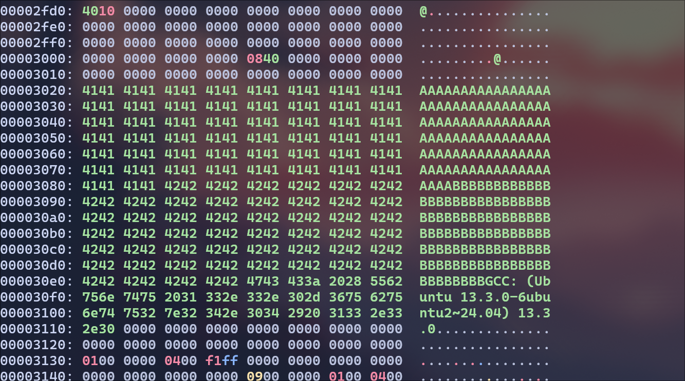

Now, the letters A start at 3020, but I wanted to split it at half of the char array(at 3084 or 12420 in decimal) so I get all A's in the prefix.

```bash
head -c 12420 a.out > prefix
```

Generating the out1.bin and out2.bin
```bash
./md5collgen -p prefix -o out1.bin out2.bin
```

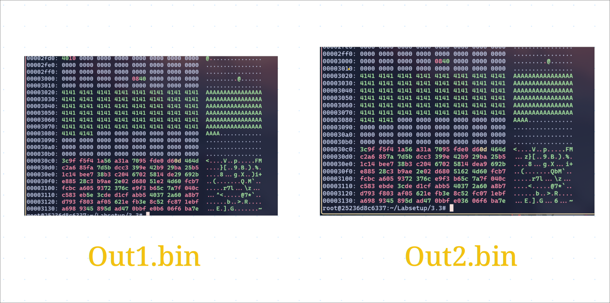

Adding the remaining text to suffix (from hex 3085 or 12421)
```bash
tail -c +12421 a.out > suffix
```
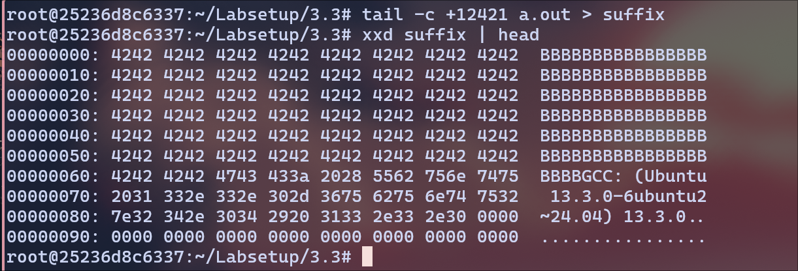

Add the suffix to out1 and out2 to create to files using `cat` command. 
Also provide the executable permissions and check the output of the files and their md5sum.

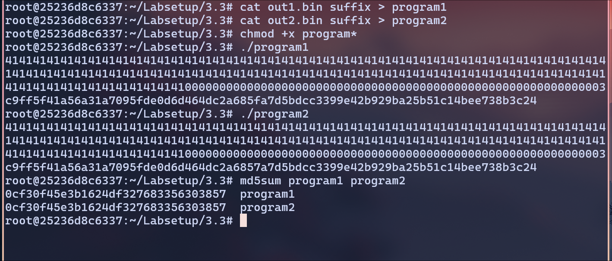

The hashes match and we get the same output for both `program1` and `program2` files.

---
---

### 3.4 Task 4: Making the Two Programs Behave Differently

The below code is used for creating two programs that behave differently.

```c
#include <stdio.h>

unsigned char Arr_A[200] = {
	0x41, 0x41, 0x41, 0x41, 0x41, 0x41, 0x41, 0x41, 0x41, 0x41,
	0x41, 0x41, 0x41, 0x41, 0x41, 0x41, 0x41, 0x41, 0x41, 0x41,
	0x41, 0x41, 0x41, 0x41, 0x41, 0x41, 0x41, 0x41, 0x41, 0x41,
	0x41, 0x41, 0x41, 0x41, 0x41, 0x41, 0x41, 0x41, 0x41, 0x41,
	0x41, 0x41, 0x41, 0x41, 0x41, 0x41, 0x41, 0x41, 0x41, 0x41,
	0x41, 0x41, 0x41, 0x41, 0x41, 0x41, 0x41, 0x41, 0x41, 0x41,
	0x41, 0x41, 0x41, 0x41, 0x41, 0x41, 0x41, 0x41, 0x41, 0x41,
	0x41, 0x41, 0x41, 0x41, 0x41, 0x41, 0x41, 0x41, 0x41, 0x41,
	0x41, 0x41, 0x41, 0x41, 0x41, 0x41, 0x41, 0x41, 0x41, 0x41,
	0x41, 0x41, 0x41, 0x41, 0x41, 0x41, 0x41, 0x41, 0x41, 0x41,
	0x42, 0x42, 0x42, 0x42, 0x42, 0x42, 0x42, 0x42, 0x42, 0x42,
	0x42, 0x42, 0x42, 0x42, 0x42, 0x42, 0x42, 0x42, 0x42, 0x42,
	0x42, 0x42, 0x42, 0x42, 0x42, 0x42, 0x42, 0x42, 0x42, 0x42,
	0x42, 0x42, 0x42, 0x42, 0x42, 0x42, 0x42, 0x42, 0x42, 0x42,
	0x42, 0x42, 0x42, 0x42, 0x42, 0x42, 0x42, 0x42, 0x42, 0x42,
	0x42, 0x42, 0x42, 0x42, 0x42, 0x42, 0x42, 0x42, 0x42, 0x42,
	0x42, 0x42, 0x42, 0x42, 0x42, 0x42, 0x42, 0x42, 0x42, 0x42,
	0x42, 0x42, 0x42, 0x42, 0x42, 0x42, 0x42, 0x42, 0x42, 0x42,
	0x42, 0x42, 0x42, 0x42, 0x42, 0x42, 0x42, 0x42, 0x42, 0x42,
	0x42, 0x42, 0x42, 0x42, 0x42, 0x42, 0x42, 0x42, 0x42, 0x42,
};

unsigned char Arr_B[200] = {
	0x41, 0x41, 0x41, 0x41, 0x41, 0x41, 0x41, 0x41, 0x41, 0x41,
	0x41, 0x41, 0x41, 0x41, 0x41, 0x41, 0x41, 0x41, 0x41, 0x41,
	0x41, 0x41, 0x41, 0x41, 0x41, 0x41, 0x41, 0x41, 0x41, 0x41,
	0x41, 0x41, 0x41, 0x41, 0x41, 0x41, 0x41, 0x41, 0x41, 0x41,
	0x41, 0x41, 0x41, 0x41, 0x41, 0x41, 0x41, 0x41, 0x41, 0x41,
	0x41, 0x41, 0x41, 0x41, 0x41, 0x41, 0x41, 0x41, 0x41, 0x41,
	0x41, 0x41, 0x41, 0x41, 0x41, 0x41, 0x41, 0x41, 0x41, 0x41,
	0x41, 0x41, 0x41, 0x41, 0x41, 0x41, 0x41, 0x41, 0x41, 0x41,
	0x41, 0x41, 0x41, 0x41, 0x41, 0x41, 0x41, 0x41, 0x41, 0x41,
	0x41, 0x41, 0x41, 0x41, 0x41, 0x41, 0x41, 0x41, 0x41, 0x41,
	0x42, 0x42, 0x42, 0x42, 0x42, 0x42, 0x42, 0x42, 0x42, 0x42,
	0x42, 0x42, 0x42, 0x42, 0x42, 0x42, 0x42, 0x42, 0x42, 0x42,
	0x42, 0x42, 0x42, 0x42, 0x42, 0x42, 0x42, 0x42, 0x42, 0x42,
	0x42, 0x42, 0x42, 0x42, 0x42, 0x42, 0x42, 0x42, 0x42, 0x42,
	0x42, 0x42, 0x42, 0x42, 0x42, 0x42, 0x42, 0x42, 0x42, 0x42,
	0x42, 0x42, 0x42, 0x42, 0x42, 0x42, 0x42, 0x42, 0x42, 0x42,
	0x42, 0x42, 0x42, 0x42, 0x42, 0x42, 0x42, 0x42, 0x42, 0x42,
	0x42, 0x42, 0x42, 0x42, 0x42, 0x42, 0x42, 0x42, 0x42, 0x42,
	0x42, 0x42, 0x42, 0x42, 0x42, 0x42, 0x42, 0x42, 0x42, 0x42,
	0x42, 0x42, 0x42, 0x42, 0x42, 0x42, 0x42, 0x42, 0x42, 0x42,
};

int main() {
	int i;
	int foundMatch = 0;
	for (i=0; i<200; i++){
		if(Arr_A[i] == Arr_B[i]) {
			foundMatch = 1;
		} else {
			foundMatch = 0;
			break;
		}
	}
 

	if(foundMatch){
		printf("Running Safe Code! and this is the intended behaviour\n");
	} else {
		printf("OOOH! Running some --MALICIOUS-- code..\n");
	}
}

```

compile the code:

```bash
gcc code.c
```


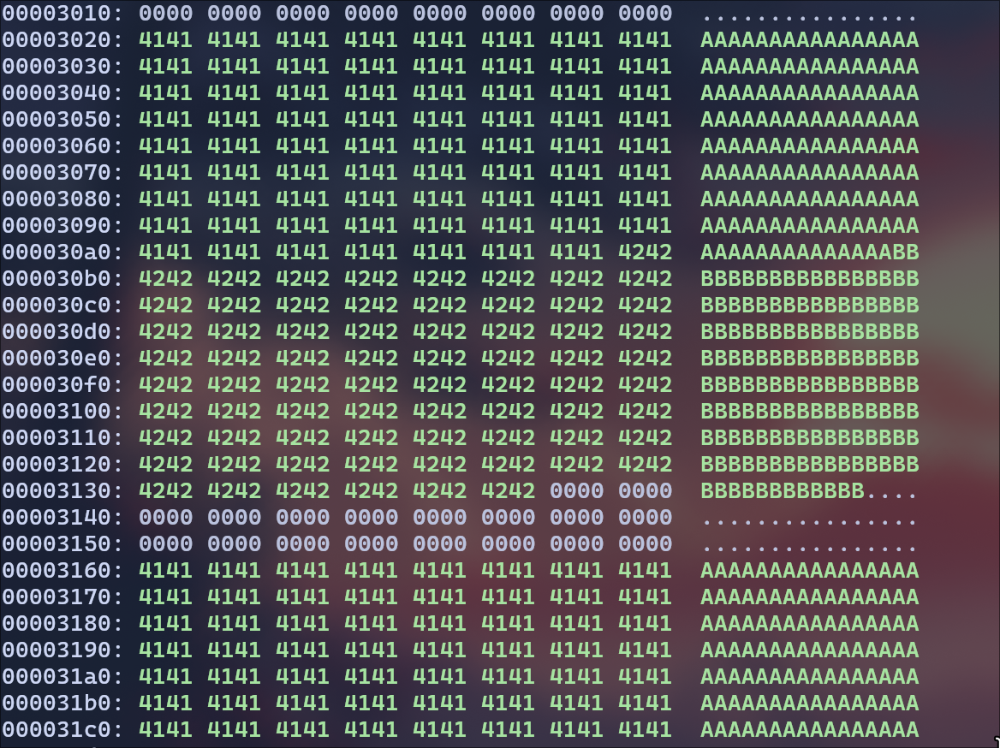

We can observe the hex values for first array starting at 3020 and so I will extract the data before this to prefix.

```bash
head -c 12420 a.out > prefix
```

Using `md5collgen`command to create 2 binary files with the same hash

```bash
./md5collgen -p prefix -o P_prefix Q_prefix
```
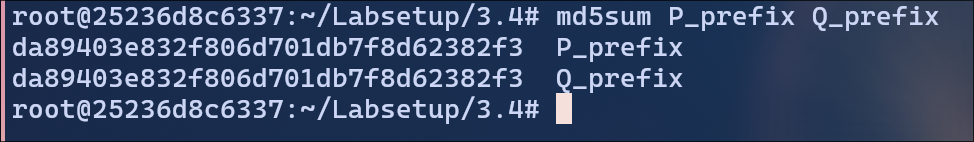

Now, we need to connect the prefix files to correct suffix files. 


Upon on observation of the prefix files, there is 188 bytes of difference b/w P_prefix and prefix file and the same for Q_prefix. 

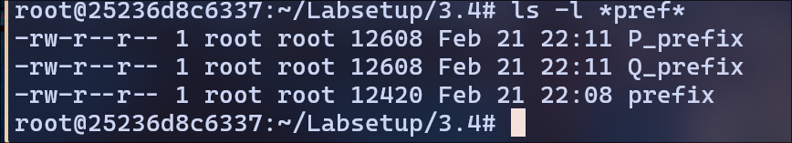

So, the suffix file is everything after the first 12421 bytes from the `a.out` file.

Create suffix:
Skip 128 bytes for P or Q
```bash
tail -c +12609 a.out > suffix
```

To get P file, we know 148 bytes are generated extra by `md5collgen`

```bash
tail -c 128 P_prefix > P
tail -c 128 Q_prefix > Q
```


checking suffix:
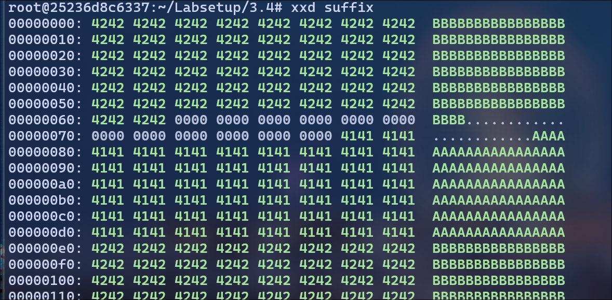
Now, we observe second array starts at 00. I'm adding extra 100 bytes to get middle of second array at e0.

```bash
head -c 32 suffix > middle
```

So, everything after `middle` file will be our `commonsuffix` file. Since `P` is 128 bytes and `middle` is about 64 bytes, the `commonsuffix` file would be everything in the `suffix` file after 362 _(128+32)_ bytes.

```bash
tail -c +161 suffix > commonsuffix
```

At final, we will concatenate everything together:


```bash
cat P_prefix middle P commonsuffix > benignCode
cat Q_prefix middle Q commonsuffix > maliciousCode
chmod +x benignCode maliciousCode
```


Verifying MD5 Hash:

```bash
md5sum program1 program2
```


> We have same hash.

Running the programs and checking their behavior.

Program1:


