-> [Check the Project Description](./project_description.md)

Reference:

```embed
title: "GitHub - nokia/TPMCourse"
image: "https://opengraph.githubassets.com/07b737a9f63fefe75aaf9ccdcee57fe8c92c18ee593b5d6e35f673e69170db29/nokia/TPMCourse"
description: "Contribute to nokia/TPMCourse development by creating an account on GitHub."
url: "https://github.com/nokia/TPMCourse/tree/master"
aspectRatio: "50"
```


---

### Task 1 Set up the environment and generate random bytes

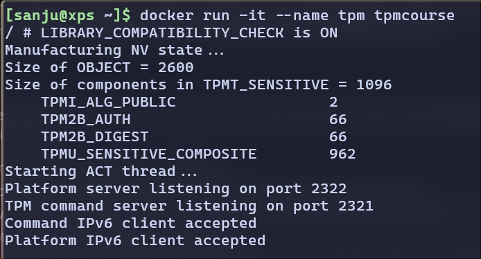

**Generating the Random bytes**

using function `tpm2_getrandom`

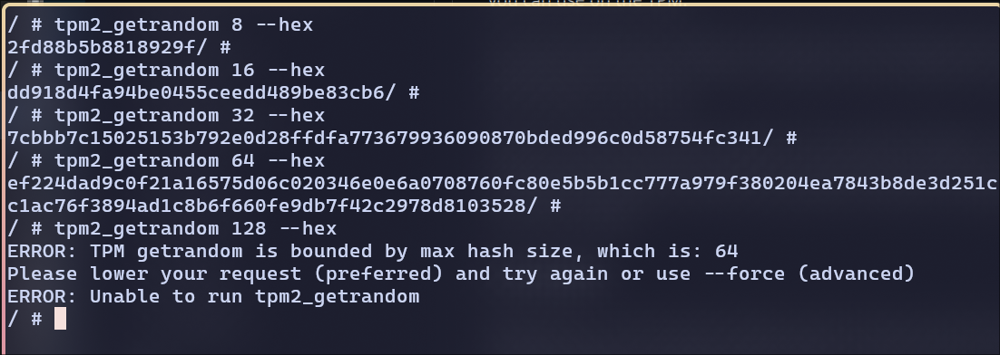
Based on my observation, I can only generate a maximum of 64 bytes. Anything beyond 64 bytes throws the max hash size error.


---
---

### Task 2 Experiment with objects


1. Assume no password is set. Set the owner's password to "ABCDE".
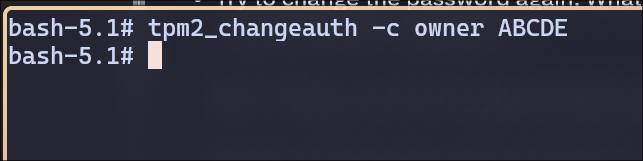
---


2. Try the same command. What messages are shown? Explain why it is not successful.
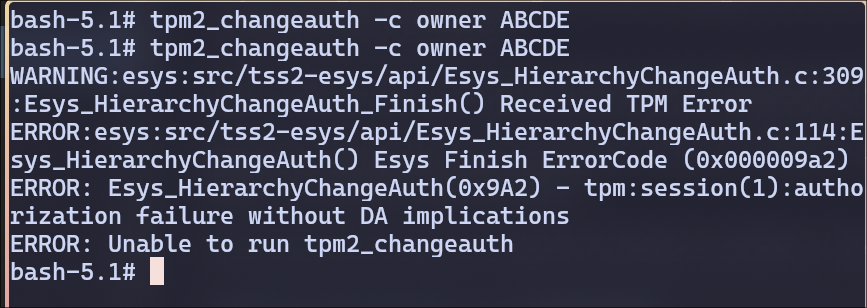


This error code `0x9A2` means **authorization failure**, likely because the TPM already has an **owner authorization** password set, and here I'm trying to set it again **without authenticating first**.

---
3. Change the owner's password to "123456".
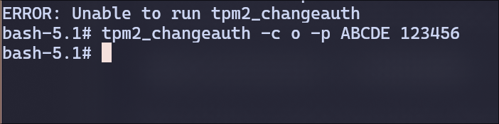

---
4. Try to change the password again. What messages are shown? Explain why it is not successful.*

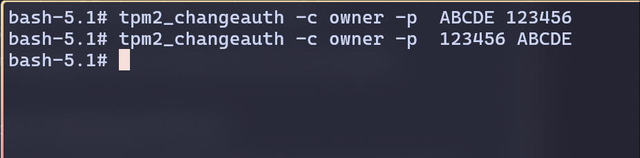

I didn't get any error if I'm updating the password.

But I get error, if I'm trying to update with old password again(re-running the previous command)

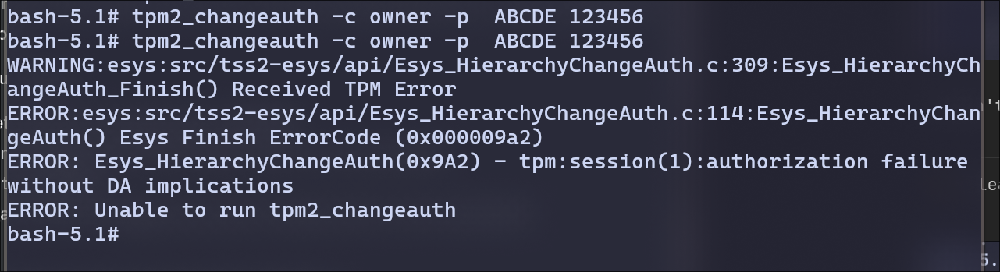

---
5. Clear the owner's password.


I cleared the password by keeping the second argument empty.

tpm2_clear doesn't accept owner as a parameter to clear. So I used `tpm2_changeauth` and left the second field empty to clear the password.


---
---
### Task 3 Keys and encryption/decryption/signing/verification

1. Generate AES key in owner's hierarchy, encrypt a plaintext file with an IV, and then decrypt it. The command in the tutorial does not have IV file. We generate 16 random bytes as IV. The same IV is required for decrypton. Find out what happens if we do not specify IV when decrypting. Can the command encrypt the largest file in the directory?

**Answer:**

Create owner hierarchy:
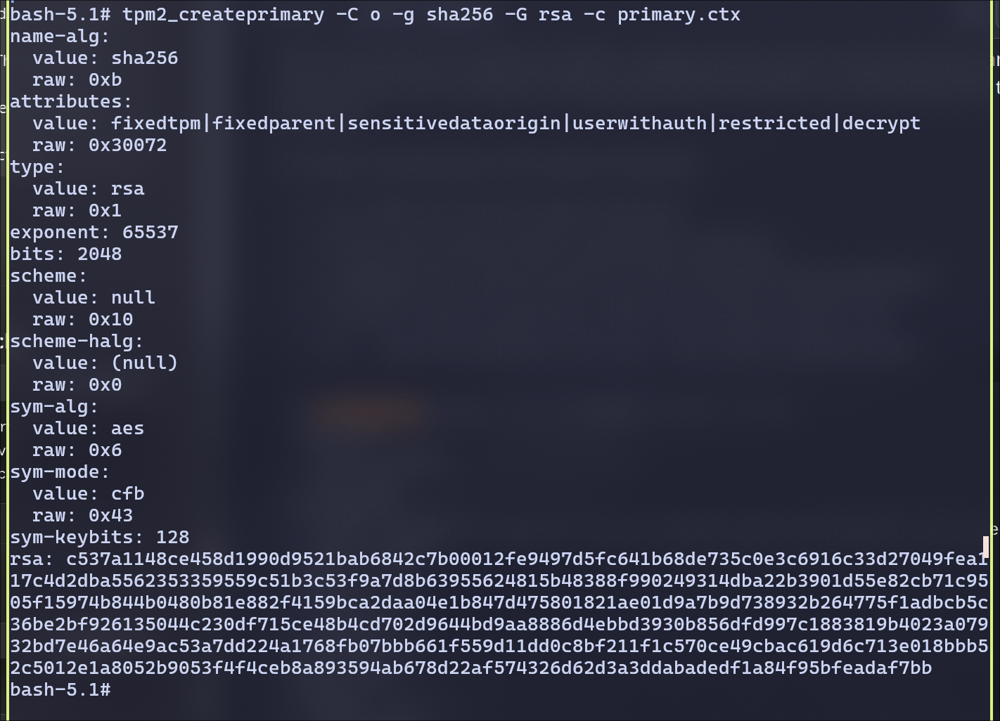

Generated an AES key in owner hierarchy
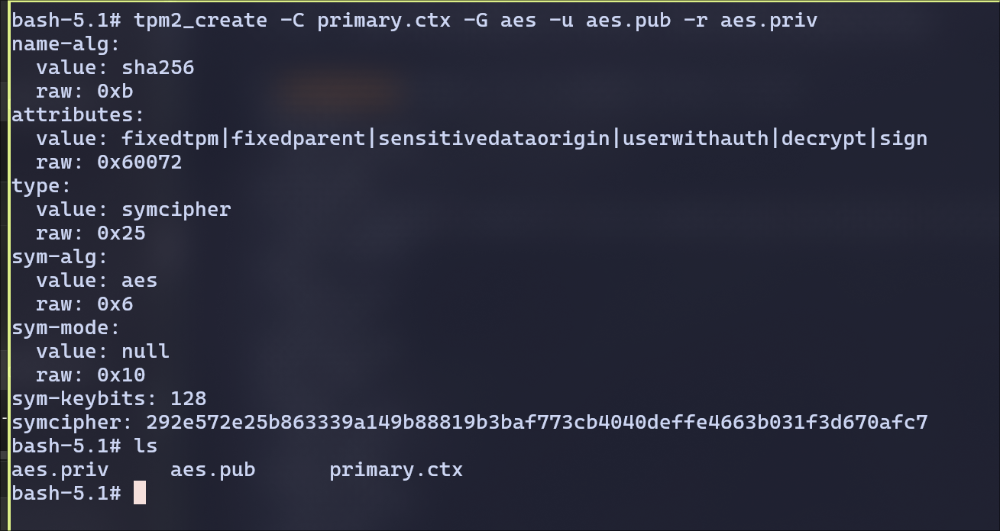

load the key into the TPM to be able to use it.
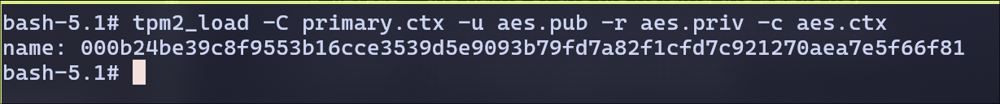

persist the key
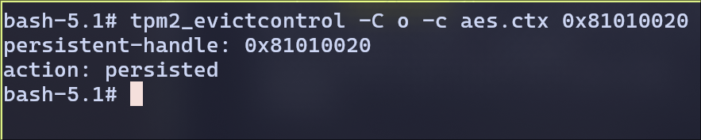
Now, we have our key persisted in the handle `0x81010020`.


Now, generating the IV of 16 random  bytes

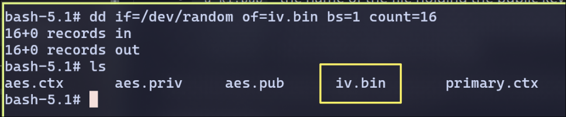

Encrypt and Decrypt plain text using the IV
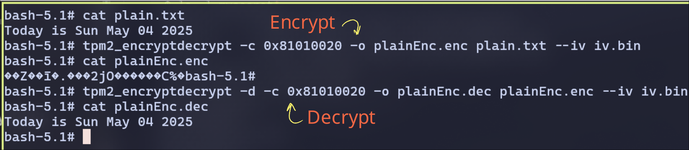

When Decrypting without IV, the output is wrong

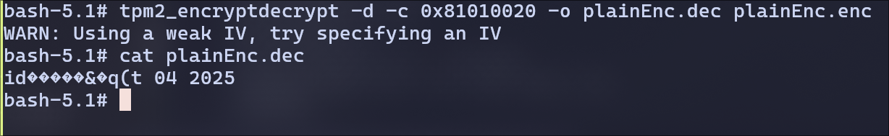
Without the same IV, AES decryption produces garbage.
This is because modes like CBC require both key and IV to align.

Encryption with large file fails

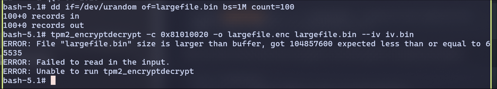

This shows the TPM can only handle ~64 KB (65535 bytes) per encryption call.

---


2. Demostrate that you can decrypt the ciphertext after the TPM restarts.

Restarting the TPM and re-creating the primary context for owner hierarchy

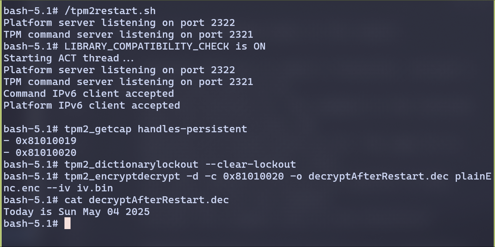

If we store the context in the persistent memory, even after restart, we can decrypt the encrypted file.

---

3. Generate an RSA key pair in owner's hierarchy, and demostrate signing and verification with the key. The process is similar to what is described in the tutorial.

**Answer:**

Generating rsa key value pairs. Loading the primary.ctx from persistent since we restarted.

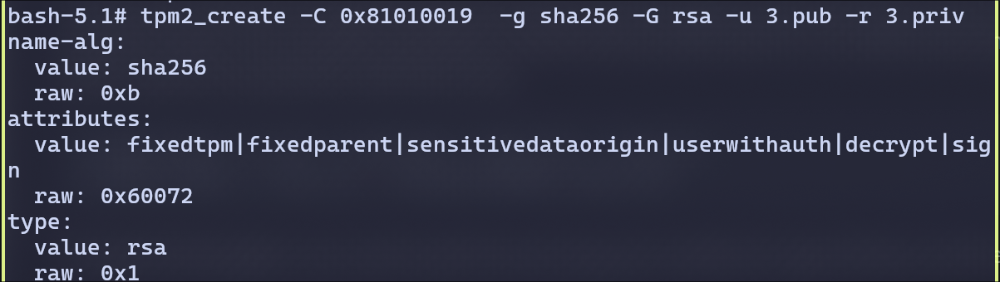

Creating a new context for the rsa and store it in persistent memory
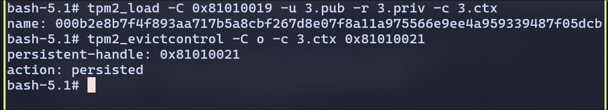

Signing and verifying with the key

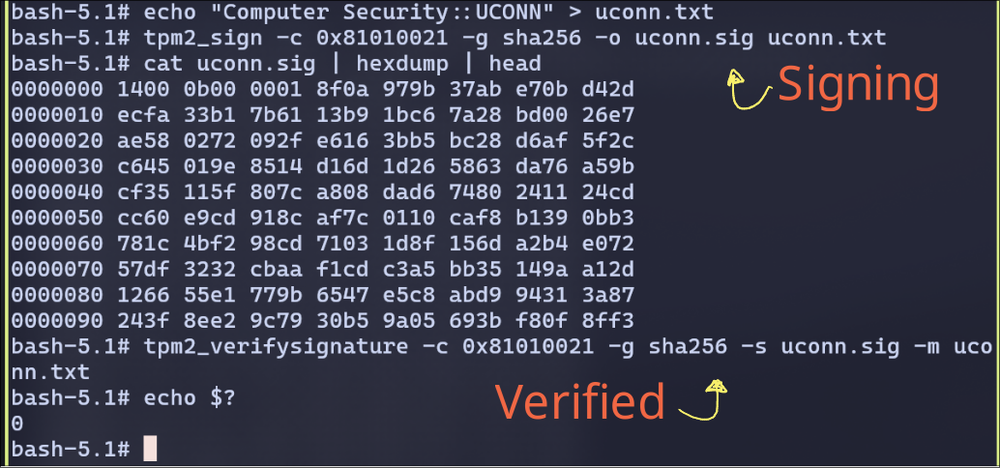

---
---

### Task 4 : Quoting

1. Reset PCR 23, extend it with the hash of `h.txt, find out the value in PCR 23. The SHA1 hash of the file ends with 0399. The updated PCR 23 value ends with 4881.

**Answer:**

I have reset the PCR 23 and hashed the `h.txt` file to confirm it ends with 0399
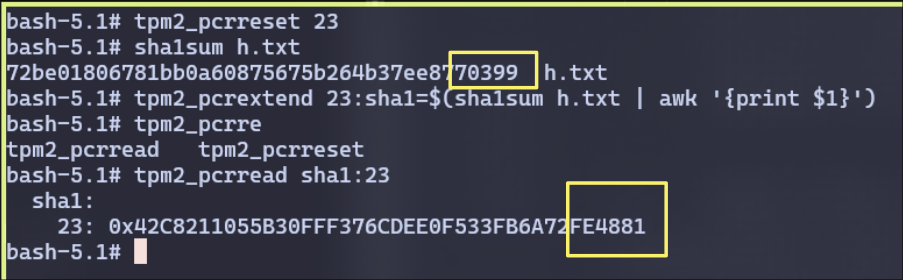

We can also observe the PCR 23 value ends with 4881

---
2. Generate endorsement key (EK) and an attestation key (AK) as in keys.md. Generate
    a quote for PCR 23 (in SHA1 bank), which has the hash from the previous step. Run `tpm2_print` to examine the quote.

**Answer:**

Endoresment Key:
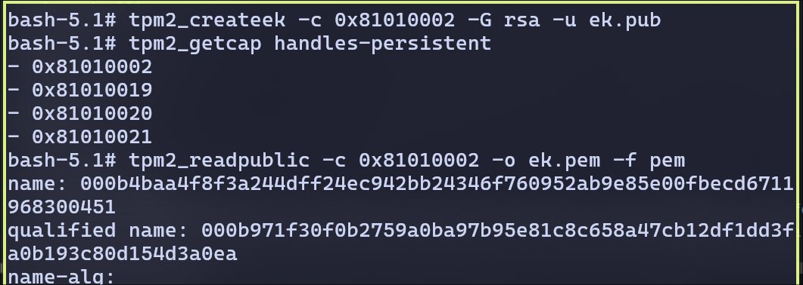


Attestation Key:
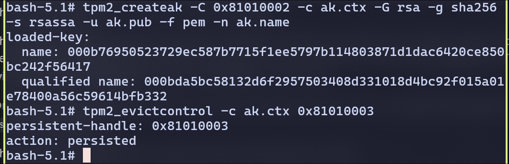


Generating the quote for PCR 23 that has hash from previous step.

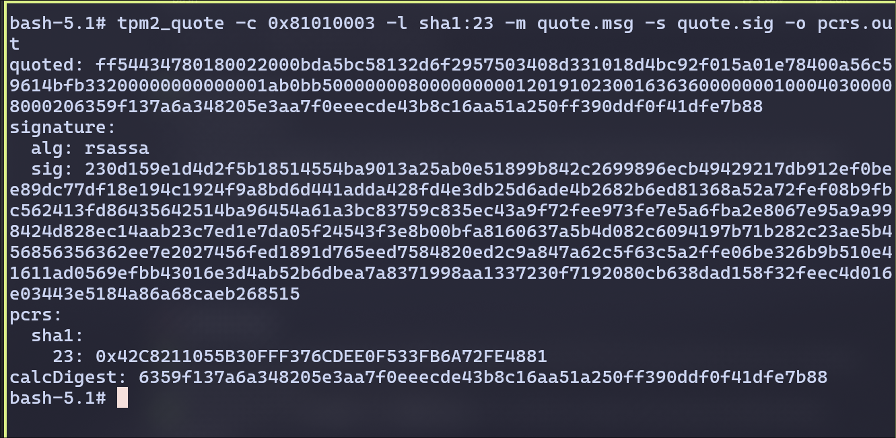

This shows the **current TPM PCR 23 value**, ending in `4881`, which matches the extended state I created in previous step.


Examining the Quote:
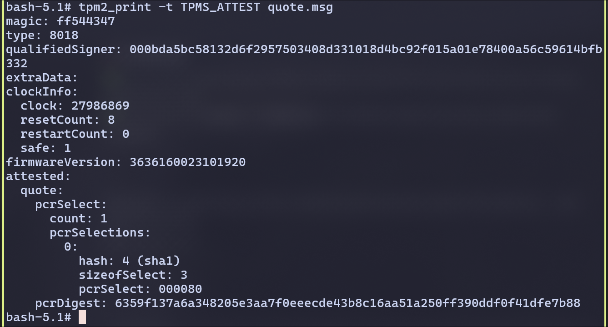

We can see the following matches:
- **Type 8018** → quote type
- **PCR selection** → SHA1, PCR 23
- **pcrDigest** → matches `calcDigest`


---

3. If we do not make AK persistent, can we use the same AK after restarting TPM?

**Answer:**

No.

Removing AK from persistent storage:
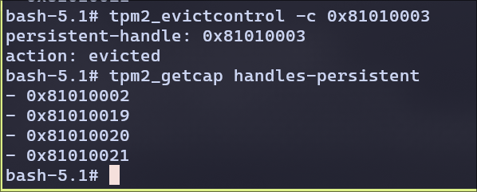


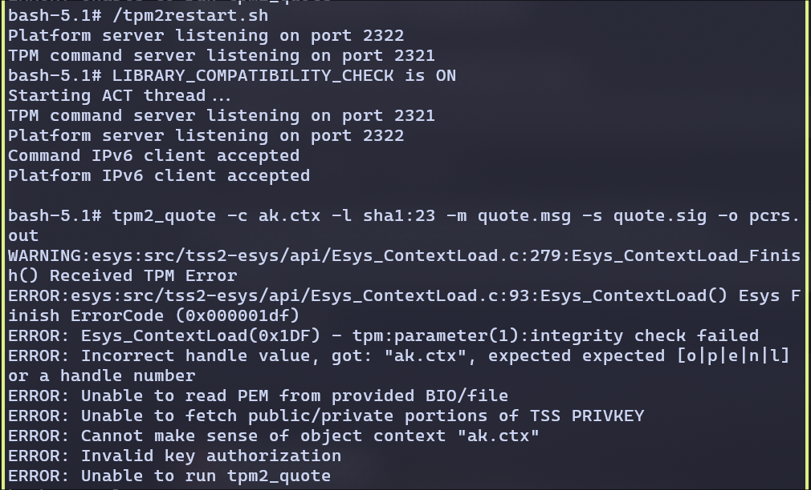

We can observe, without making the AK persistent and restarting the Attestation won't work.

---
---

### Task 5: Sealing and unsealing


1. We create a policy that specifies the set of PCRs to be used in sealing. The "Policy Creation" section in `nvram.md` has examples of creating policy. We will include PCR 23 (SHA1) only in our policy (and we can easily
    include more PCRs). PCR 23 must have the hash value extended by `h.txt` from 0.

    Note that if PCR 23 has the correct hash value, we do not need to use the `-f`option for `tpm2_createpolicy`.

**Answer:**

Extending `PCR23` with h.txt file's hash
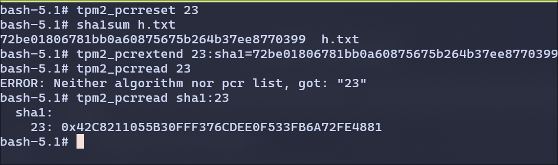


Create a policy bound to PCR 23
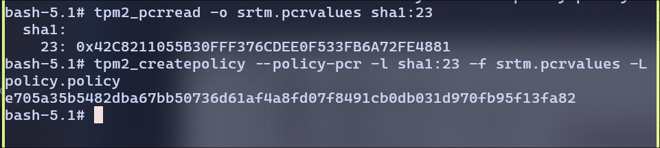

---

2. Seal file `secret` with the primary key in owner's hierarchy and the policy created in the previous step. Demonstrate that you can unseal the blob.

**Answer:**

creating primary key in owner hierarchy

```bash
tpm2_createprimary -C o -g sha256 -G aes -c primary.ctx
```

```bash
bash-5.1# tpm2_evictcontrol -C o -c primary.ctx 0x81010010
persistent-handle: 0x81010010
action: persisted
```

Sealing the file `secret`

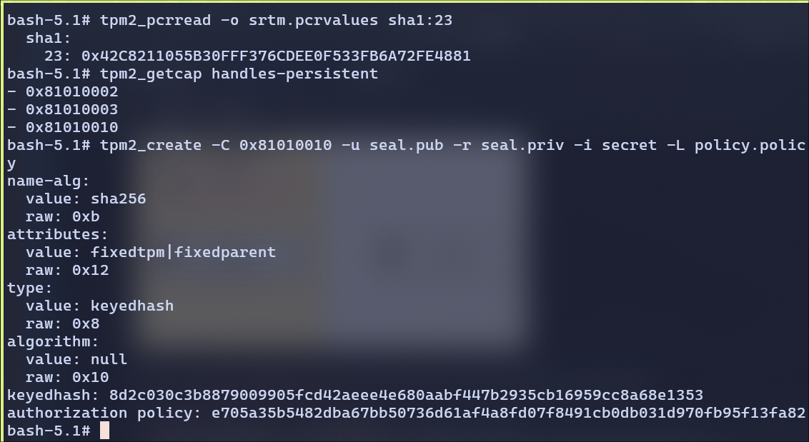

Unsealing the file secret:

Load the object:

```bash
tpm2_load -C primary.ctx -u seal.pub -r seal.priv -c seal.ctx
```

and now we can unseal the object
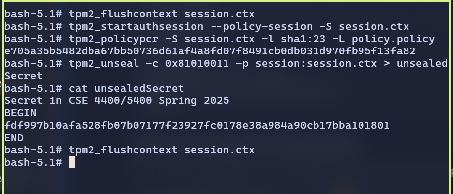

For unsealing the secret, I had to create an auth session using the policy I created earlier. Then set the session from PCR 23 using the policy file and then able to unseal the secret.


---

3. Demonstrate that if PCR 23 does not have the correct value, you cannot unseal the blob.

**Answer:**

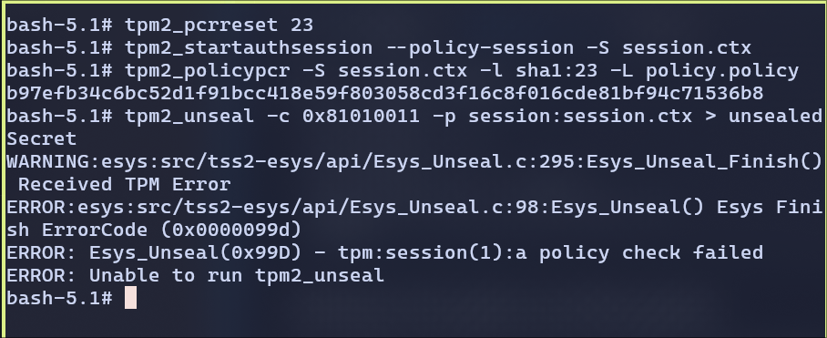


I have reset the PCR and followed the same steps as previous. We cannot unseal the blob if PCR doesn't match.

This confirms the TPM enforces the **measured PCR state**and refuses access if the policy doesn’t match


---


4. Demonstrate that you can unseal the the blob after restarting the TPM.
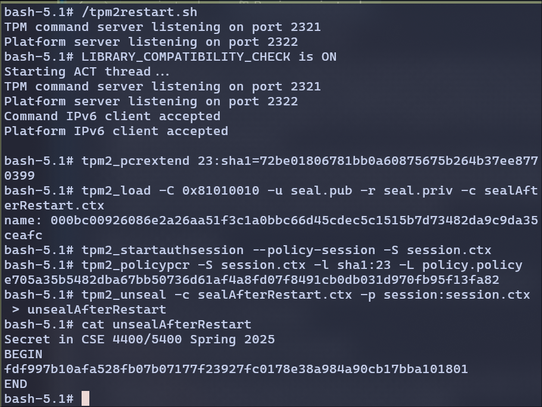

From the above screenshot, we can observe that I have restarted the TPM. I made sure that primary.ctx is already persistent.
- After restart, I set the PCR 23 values to sha1sum of h.txt
- created new context from primary using seal.pub and seal.priv.
- Started the session
- set the policy from the PCR 23
- Unsealed the secret
- Displayed the output.

So Even after reboot, if we:
- Re-extend the PCRs properly
- Use persistent objects or reload them correctly
- and Recreate the policy session
- We can successfully unseal the data.
---
---

EOF
